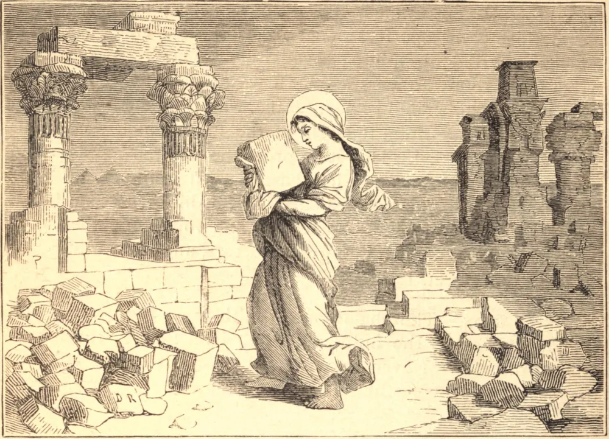

# 13 de março — SANTA EUFRÁSIA, Virgem

EUFRÁSIA era filha de pais piedosos e nobres. Após a morte de seu pai, a sua viúva retirou-se em particular, com a sua filhinha, para o Egito, onde possuía uma propriedade muito vasta. Naquele país fixou a sua morada perto de um santo mosteiro de cento e trinta freiras. A jovem Eufrásia, aos sete anos de idade, suplicou que lhe fosse permitido servir a Deus naquele mosteiro. A piedosa mãe, ao ouvir isto, chorou de alegria, e não muito depois apresentou a sua filha à abadessa, a qual, tomando uma imagem de Cristo, deu-a a Eufrásia. A terna virgem beijou-a, dizendo: "Por voto consagro-me a Cristo." Então a mãe a conduziu diante de uma imagem de Nosso Redentor, e, erguendo as mãos ao céu, disse: "Senhor Jesus Cristo, recebei esta criança sob a vossa especial proteção. Só a Vós ela ama e busca: a Vós ela se recomenda." Então, deixando-a nas mãos da abadessa, saiu do mosteiro chorando.

Algum tempo depois disto, a boa mãe adoeceu, e logo adormeceu em paz. À notícia de sua morte, o Imperador Teodósio mandou chamar a nobre virgem para que viesse à corte, havendo-a prometido em casamento a um jovem senador de seu favor. Mas a virgem escreveu-lhe recusando a aliança, repetindo o seu voto de virgindade, e pedindo que as suas propriedades fossem vendidas e repartidas entre os pobres, e todos os seus escravos postos em liberdade. O Imperador executou pontualmente tudo o que ela desejava, pouco antes de sua morte em 395.

Santa Eufrásia foi um modelo perfeito de humildade, mansidão e caridade. Se se via assaltada por alguma tentação, imediatamente buscava o conselho da abadessa, que muitas vezes lhe impunha, em tais ocasiões, algum trabalho penitencial humilhante e penoso, como por vezes carregar grandes pedras de um lugar a outro; ocupação que ela certa vez, sob um assalto obstinado, continuou trinta dias seguidos com admirável simplicidade, até que o demônio, vencido por sua humilde obediência e pelo castigo de seu corpo, a deixou em paz. Foi favorecida com milagres tanto antes quanto depois de sua morte, que aconteceu no ano de 410, o trigésimo de sua idade.
