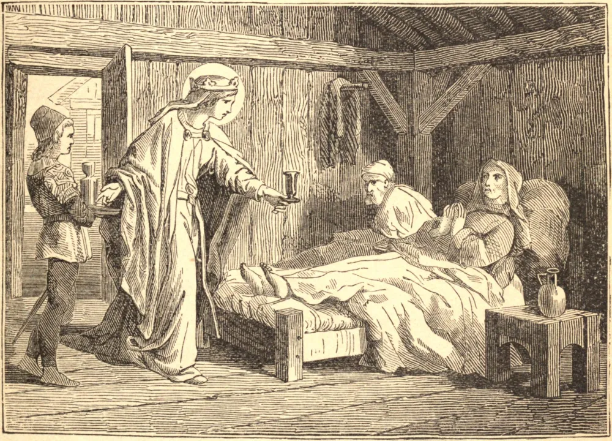

# 14 de março — SANTA MAUD, Rainha

ESTA princesa era filha de Teodorico, um poderoso conde saxão. Seus pais a colocaram muito jovem no mosteiro de Erford, do qual sua avó Maud era então abadessa. Nossa Santa permaneceu naquela casa, modelo acabado de todas as virtudes, até que seus pais a desposaram com Henrique, filho de Otão, Duque da Saxônia, em 913, que foi depois escolhido rei da Alemanha. Era ele um príncipe piedoso e vitorioso, e muito terno para com seus súditos. Enquanto pelas armas reprimia a insolência dos húngaros e dos dinamarqueses, e ampliava seus domínios acrescentando-lhes a Baviera, Maud alcançava vitórias domésticas sobre seus inimigos espirituais mais dignas de uma cristã e muito maiores aos olhos do Céu. Ela nutria as preciosas sementes da devoção e da humildade em seu coração mediante a oração e a meditação assíduas. Era sua delícia visitar, consolar e exortar os enfermos e os aflitos; servir e instruir os pobres, e prestar seu caritativo socorro aos prisioneiros. Seu esposo, edificado pelo seu exemplo, concorria com ela em toda obra piedosa que ela projetava. Após vinte e três anos de matrimônio, aprouve a Deus chamar o rei a si, em 936. Maud, durante a enfermidade dele, foi à igreja derramar sua alma em oração por ele ao pé do altar. Tão logo soube, pelas lágrimas e clamores do povo, que ele havia expirado, mandou chamar um sacerdote que estivesse em jejum para oferecer o santo sacrifício por sua alma. Teve três filhos: Otão, depois imperador; Henrique, Duque da Baviera; e São Brunão, Arcebispo de Colônia. Otão foi coroado rei da Alemanha em 937, e imperador em Roma em 962, após suas vitórias sobre os boêmios e os lombardos. Os dois filhos mais velhos conspiraram para despojar Maud de seu dote, sob o injusto pretexto de que ela havia dissipado as rendas do Estado com os pobres. Os desnaturados príncipes por fim se arrependeram de sua injustiça e lhe restituíram tudo quanto lhe havia sido tirado. Tornou-se ela então mais generosa em suas esmolas do que nunca, e fundou muitas igrejas, com cinco mosteiros. Em sua última enfermidade, fez sua confissão a seu neto Guilherme, Arcebispo de Mogúncia, que todavia morreu doze dias antes dela, em seu caminho de volta para casa. Fez ela novamente uma confissão pública diante dos sacerdotes e monges do lugar, recebeu uma segunda vez os últimos sacramentos e, deitada sobre um cilício, com cinzas na cabeça, morreu no dia 14 de março de 968.

## Reflexão

O princípio da verdadeira virtude é desejá-la com o maior ardor, e pedi-la a Deus com a máxima assiduidade e seriedade. A oração fervorosa, a santa meditação e a leitura de livros piedosos são os principais meios pelos quais esta virtude há de ser constantemente aperfeiçoada, e a vida interior da alma fortalecida.
