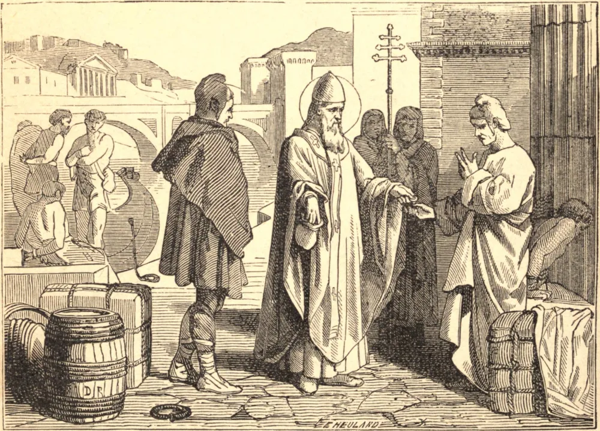

# 15 de março — SÃO ZACARIAS, Papa

SÃO ZACARIAS sucedeu a Gregório III, em 741, e era um homem de singular mansidão e bondade. Amava de tal maneira o clero e o povo de Roma que arriscou a vida por eles por ocasião das perturbações em que caiu a Itália pela rebelião dos Duques de Espoleto e de Benevento contra o Rei Liutprando. Por respeito à sua santidade e dignidade, aquele rei restituiu à Igreja de Roma todos os lugares que lhe pertenciam, e devolveu os cativos sem resgate. Os lombardos se comoveram até as lágrimas com a devoção com que o ouviram celebrar o ofício divino. O zelo e a prudência deste santo Papa transpareceram em muitos salutares regulamentos que ele fez para reformar ou consolidar a disciplina e a paz de diversas igrejas. São Bonifácio, o Apóstolo da Alemanha, escreveu-lhe contra certo sacerdote chamado Virgílio, que se esforçava por semear as sementes da discórdia entre ele e Odilo, Duque da Baviera, e ensinava, ademais, muitos erros. Zacarias ordenou que Virgílio fosse enviado a Roma, para que sua doutrina pudesse ser examinada. Parece que ele se justificou; pois encontramos este mesmo Virgílio pouco depois feito Bispo de Salzburgo. Tendo certos mercadores venezianos comprado em Roma muitos escravos para vendê-los aos mouros na África, São Zacarias proibiu tão iníquo tráfico, e, pagando aos mercadores o seu preço, deu aos escravos a liberdade. Adornou Roma com edifícios sagrados, e com grandes fundações em favor dos pobres e dos peregrinos, e dava todos os anos uma considerável soma para fornecer óleo para as lâmpadas da Igreja de São Pedro. Morreu em 752, no mês de março.
