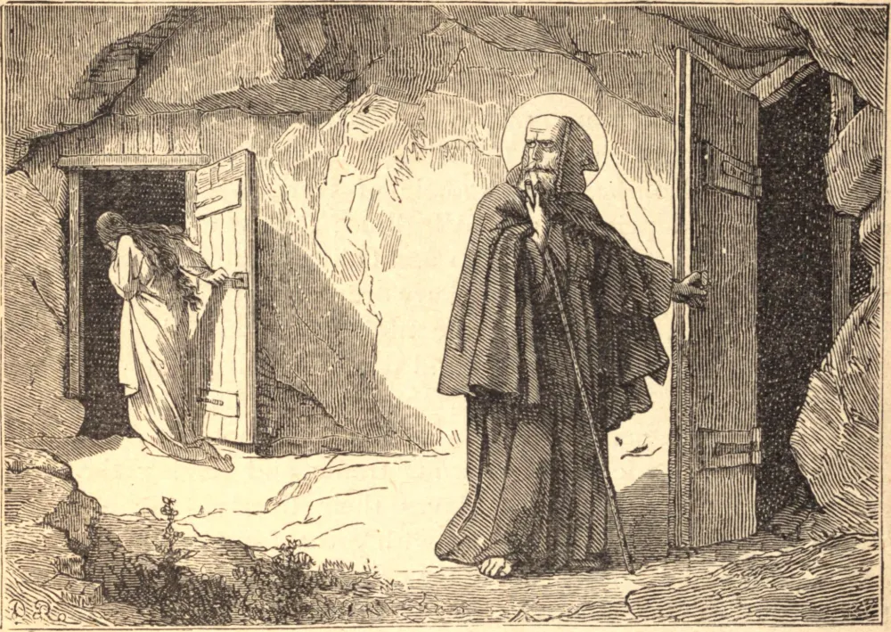

# 16 de março — SANTO ABRAÃO e SANTA MARIA

ABRAÃO era um rico nobre de Edessa. A pedido de seus pais, casou-se, mas fugiu para uma cela próxima da cidade tão logo terminada a festa. Emparedou a porta da cela, deixando apenas uma pequena janela através da qual recebia o seu alimento. Ali, por cinquenta anos, cantou os louvores de Deus e implorou misericórdia para si e para todos os homens. A riqueza que lhe coube por morte de seus pais ele a deu aos pobres. Como muitos o procuravam em busca de conselho e consolo, o Bispo de Edessa, a despeito de sua humildade, ordenou-o sacerdote. Santo Abraão foi enviado, logo após sua ordenação, a uma cidade idólatra que até então fora surda a todo mensageiro. Foi insultado, espancado e três vezes banido, mas voltava a cada vez com renovado zelo. Por três anos intercedeu junto a Deus por aquelas almas, e ao final prevaleceu. Cada cidadão veio a ele para o Batismo. Depois de prover às suas necessidades espirituais, retornou à sua cela mais do que nunca convencido do poder da oração. Seu irmão morreu, deixando aos cuidados do Santo uma única filha, Maria. Ele a colocou em uma cela próxima à sua, e dedicou-se a formá-la na perfeição. Após vinte anos de inocência, ela caiu, e fugiu em desespero para uma cidade distante, onde afogou no pecado a voz da consciência. O Santo e seu amigo Santo Efrém oraram fervorosamente por ela durante dois anos. Então ele foi disfarçado em busca da ovelha perdida, e teve a alegria de trazê-la de volta ao deserto como verdadeira penitente. Recebeu ela o dom dos milagres, e seu semblante, após a morte, resplandeceu como o sol. Santo Abraão morreu cinco anos antes dela, por volta de 360. Toda Edessa veio receber sua última bênção e assegurar suas relíquias.

## Reflexão

Oh, se compreendêssemos a onipotência da oração! Cada alma foi criada para glorificar a Deus eternamente; e está no poder de cada um acrescentar, pela salvação do próximo, à glória de Deus. Façamos bom uso deste talento da oração, para que o sangue de nosso irmão não nos seja pedido no último dia.
