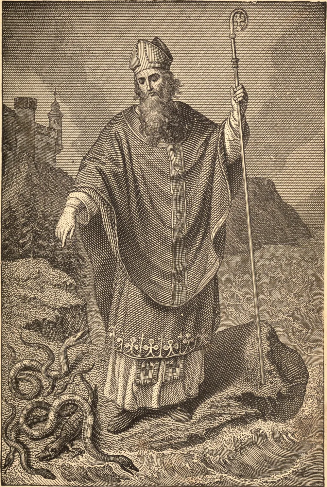
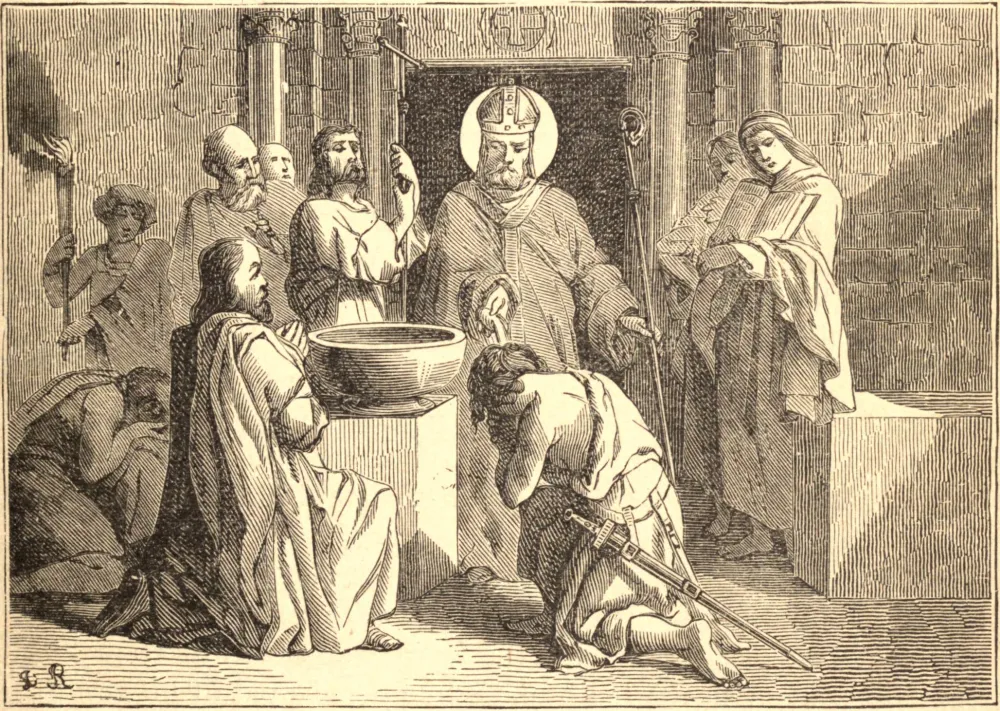

# 17 de março — SÃO PATRÍCIO, Bispo, Apóstolo da Irlanda

SE a virtude dos filhos reflete uma honra sobre seus pais, com muito mais justiça é o nome de São Patrício tornado ilustre pelas inumeráveis luzes de santidade com que a Igreja da Irlanda resplandeceu durante muitas eras, e pelas colônias de Santos com que povoou muitos países estrangeiros; pois, sob Deus, seus habitantes derivaram de seu glorioso apóstolo os fluxos daquela eminente santidade pela qual por muito tempo foram conspícuos ao mundo inteiro. São Patrício nasceu por volta do fim do quarto século, numa aldeia chamada Bonaven Taberniæ, que parece ser a cidade de Kilpatrick, na foz do rio Clyde, na Escócia, entre Dumbarton e Glasgow. Chama a si mesmo bretão e romano, ou de extração mista, e diz que seu pai era de uma boa família chamada Calfúrnio, e cidadão de uma vizinha cidade dos romanos, que não muito depois abandonaram a Britânia, em 409. Alguns escritores chamam sua mãe Conchessa, e dizem que ela era sobrinha de São Martinho de Tours.

Em seu décimo sexto ano foi levado ao cativeiro por certos bárbaros, que o conduziram à Irlanda, onde foi obrigado a guardar o gado nas montanhas e nas florestas, em fome e nudez, em meio à neve, à chuva e ao gelo. Enquanto vivia nesta condição de sofrimento, Deus teve piedade de sua alma, e o despertou para o senso de seu dever pelo impulso de uma forte graça interior. O jovem recorreu a Ele de todo o seu coração em fervorosa oração e jejum; e desde aquele tempo a fé e o amor de Deus adquiriram continuamente novo vigor em sua tenra alma. Após seis meses passados na escravidão sob o mesmo senhor, São Patrício foi advertido por Deus em sonho a retornar à sua própria terra, e informado de que um navio estava então pronto para zarpar para lá. Foi imediatamente para a costa do mar, ainda que a grande distância, e encontrou o navio; mas não conseguiu obter sua passagem, provavelmente por falta de dinheiro. O Santo retornava para a sua cabana, orando pelo caminho; mas os marinheiros, embora pagãos, chamaram-no de volta e tomaram-no a bordo. Após três dias de navegação, avistaram terra, mas vaguearam vinte e sete dias por desertos, e por longo tempo se viram angustiados pela falta de provisões, nada encontrando para comer. Patrício muitas vezes falara à companhia sobre o infinito poder de Deus; perguntaram-lhe, pois, por que não orava por socorro. Animado por uma forte fé, assegurou-lhes que, se eles se dirigissem de todo o coração ao verdadeiro Deus, Ele os ouviria e socorreria. Assim fizeram, e no mesmo dia encontraram uma manada de porcos. Desde então nunca mais lhes faltaram provisões, até que, no vigésimo sétimo dia, chegaram a uma terra que era cultivada e habitada.

Alguns anos depois foi novamente levado cativo, mas recuperou sua liberdade após dois meses. Quando estava em casa com seus pais, Deus lhe manifestou, por diversas visões, que o destinava à grande obra da conversão da Irlanda. Os escritores de sua vida dizem que, após seu segundo cativeiro, viajou para a Gália e para a Itália, e viu São Martinho, São Germano de Auxerre e o Papa Celestino, e que recebeu sua missão e a bênção apostólica deste Papa, que morreu em 432. É certo que ele passou muitos anos preparando-se para sua sagrada vocação. Grande oposição se fez à sua consagração e missão episcopais, tanto por seus próprios parentes quanto pelo clero. Estes lhe faziam grandes ofertas a fim de retê-lo entre eles, e procuravam atemorizá-lo exagerando os perigos a que se expunha em meio aos inimigos dos romanos e bretões, que não conheciam a Deus. Todas estas tentações lançaram o Santo em grandes perplexidades; mas o Senhor, cuja vontade ele consultava em fervorosa oração, sustentou-o, e ele perseverou em sua resolução. Abandonou sua família, vendeu seu direito de primogenitura e sua dignidade, para servir a estrangeiros, e consagrou sua alma a Deus, para levar Seu nome aos confins da terra. Nesta disposição passou à Irlanda, para pregar o Evangelho, onde o culto dos ídolos ainda reinava de modo geral. Dedicou-se inteiramente à salvação destes bárbaros. Percorreu toda a ilha, penetrando nos mais remotos recantos, e tal foi o fruto de suas pregações e sofrimentos que batizou um número infinito de pessoas. Ordenou clérigos por toda parte, induziu mulheres a viver em santa viuvez e continência, consagrou virgens a Cristo, e instituiu monges. Nada tomava dos muitos milhares que batizava, e muitas vezes devolvia os pequenos presentes que alguns depositavam sobre o altar, preferindo antes mortificar os fervorosos a escandalizar os fracos ou os infiéis. Dava livremente do que era seu, contudo, tanto a pagãos quanto a cristãos, distribuía largas esmolas aos pobres nas províncias por onde passava, fazia presentes aos reis, julgando-o necessário para o progresso do Evangelho, e mantinha e educava muitas crianças, que formava para servir ao altar. O feliz êxito de seus labores custou-lhe muitas perseguições.

Certo príncipe chamado Corotick, cristão apenas de nome, perturbou a paz de seu rebanho. Este tirano, tendo feito uma incursão na Irlanda, saqueou a região onde São Patrício acabara de conferir a Crisma a um grande número de neófitos, que ainda traziam suas vestes brancas após o Batismo. Corotick massacrou muitos, e levou outros, que vendeu aos infiéis pictos ou escotos. No dia seguinte, o Santo enviou ao bárbaro uma carta suplicando-lhe que restituísse os cativos cristãos, e ao menos parte do despojo que tomara, para que o pobre povo não perecesse por falta, mas só obteve por resposta zombarias. O Santo, portanto, escreveu de próprio punho uma carta. Nela intitula-se um pecador e um homem ignorante; declara, contudo, que está estabelecido Bispo da Irlanda, e pronuncia Corotick e os outros parricidas e cúmplices separados dele e de Jesus Cristo, cujo lugar ele ocupa, proibindo a quem quer que seja de comer com eles, ou de receber suas esmolas, até que tivessem satisfeito a Deus pelas lágrimas de uma sincera penitência, e restituído os servos de Jesus Cristo à sua liberdade. Esta carta exprime seu mais terno amor por seu rebanho, e sua dor por aqueles que haviam sido mortos, mesclada todavia com alegria, porque reinam com os profetas, os apóstolos e os mártires. Jocelin assegura-nos que Corotick foi alcançado pela vingança divina.

São Patrício realizou diversos concílios para consolidar a disciplina da Igreja que havia plantado. São Bernardo e a tradição do país atestam que São Patrício fixou sua sé metropolitana em Armagh. Estabeleceu alguns outros bispos, como se vê por seu Concílio e outros monumentos. Não somente converteu todo o país por sua pregação e prodigiosos milagres, mas também cultivou esta vinha com tão fecunda bênção e crescimento do céu que tornou a Irlanda um florescentíssimo jardim na Igreja de Deus, e uma terra de Santos.

Muitos pormenores se relatam dos labores de São Patrício, que passamos em silêncio. No primeiro ano de sua missão, tentou pregar Cristo na assembleia geral dos reis e estados de toda a Irlanda, realizada anualmente em Tara, residência do rei supremo, intitulado o monarca de toda a ilha, e principal sede dos druidas, ou sacerdotes, e de seus ritos pagãos. O filho de Neill, o monarca supremo, declarou-se contra o pregador; contudo, Patrício converteu vários, e, em seu caminho para aquele lugar, o pai de São Benigno, seu sucessor imediato na sé de Armagh. Converteu e batizou depois os reis de Dublin e de Munster, e os sete filhos do rei de Connaught, com a maior parte de seus súditos, e antes de sua morte quase toda a ilha. Fundou um mosteiro em Armagh; outro chamado Domnach-Padraig, ou Igreja de Patrício; também um terceiro, chamado Sabhal-Padraig; e encheu o país de igrejas e escolas de piedade e saber, cuja reputação, pelos três séculos seguintes, atraiu muitos estrangeiros à Irlanda. Morreu e foi sepultado em Down, no Ulster. Seu corpo foi ali encontrado numa igreja com seu nome em 1185, e transladado para outra parte da mesma igreja.

A Irlanda é o viveiro de onde São Patrício enviou seus missionários e mestres. Glastonbury e Lindisfarne, Ripon e Malmesbury, dão testemunho dos labores de sacerdotes e bispos irlandeses pela conversão da Inglaterra. Iona é até hoje o lugar mais venerado da Escócia. Columbano, Fiacre, Galo e muitos outros evangelizaram os "lugares ásperos" da França e da Suíça. A América e a Austrália, nos tempos modernos, devem seu cristianismo à fé e ao zelo dos filhos e filhas de São Patrício.

**Reflexão**—Pela instrumentalidade de São Patrício, a Fé está hoje tão viva na Irlanda, mesmo neste frio século dezenove, como quando foi plantada pela primeira vez. Pedi-lhe que vos obtenha a graça especial de seus filhos — preferir a perda de todo bem terreno ao menor compromisso em matéria de fé.
