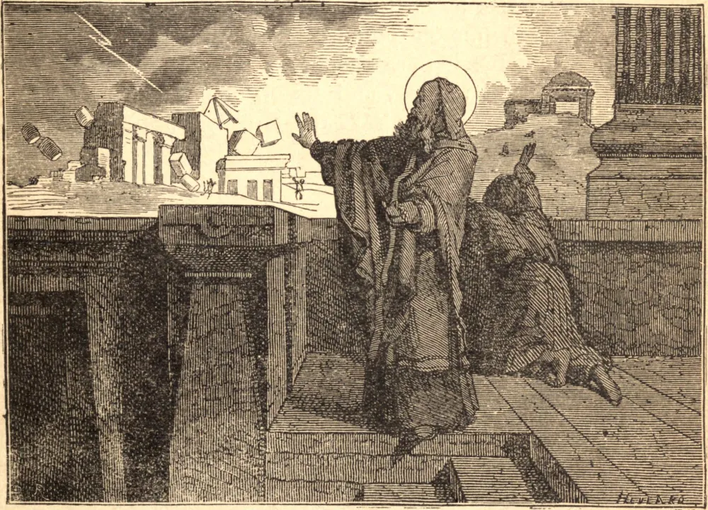

# 18 de março — SÃO CIRILO DE JERUSALÉM

CIRILO nasceu na cidade de Jerusalém, ou próximo dela, por volta do ano 315. Foi ordenado sacerdote por São Máximo, que lhe confiou o importante encargo de instruir e preparar os candidatos ao Batismo. Este encargo ele o exerceu por vários anos, e ainda possuímos uma série de suas instruções, dadas no ano de 347 ou 318. São de singular interesse por serem o mais antigo registro do ensino sistemático da Igreja sobre o credo e os sacramentos, e por terem sido dadas na igreja construída por Constantino sobre o Monte Calvário. São sólidas, simples, profundas; saturadas da Sagrada Escritura; exatas, precisas e concisas; e, como testemunho e exposição da fé católica, inestimáveis.

Por morte de São Máximo, Cirilo foi escolhido Bispo de Jerusalém. No início de seu episcopado, viu-se uma cruz no ar, estendendo-se do Monte Calvário ao Monte das Oliveiras, e tão resplandecente que brilhava ao meio-dia. São Cirilo deu conta dela ao imperador; e os fiéis a consideraram um presságio de vitória sobre os hereges arianos.

Enquanto Cirilo era bispo, o apóstata Juliano resolveu desmentir as palavras de Nosso Senhor reconstruindo o Templo em Jerusalém. Empregou o poder e os recursos de um imperador romano; os judeus acorreram a ele com entusiasmo e contribuíram com munificência. Mas Cirilo permaneceu inabalável. "A palavra de Deus permanece", disse ele; "não ficará pedra sobre pedra." Quando a tentativa foi feita, um escritor pagão nos refere que horríveis chamas brotaram da terra, tornando o lugar inacessível aos operários chamuscados e aterrorizados. A tentativa foi feita uma e outra vez, e então abandonada no desespero.

Pouco depois, o imperador pereceu miseravelmente numa guerra contra os persas, e a Igreja teve repouso. Como os outros grandes bispos de seu tempo, Cirilo foi perseguido, e expulso uma e outra vez de sua sé; mas, por morte do imperador ariano Valente, retornou a Jerusalém. Esteve presente ao segundo Concílio Geral em Constantinopla, e morreu em paz em 386, após um conturbado episcopado de trinta e cinco anos.

**Reflexão**—"Como um robusto bordão", diz São João Crisóstomo, "sustenta os membros trêmulos de um velho débil, assim a fé sustenta a nossa mente vacilante, para que não seja sacudida pela hesitação e a perplexidade pecaminosas."
