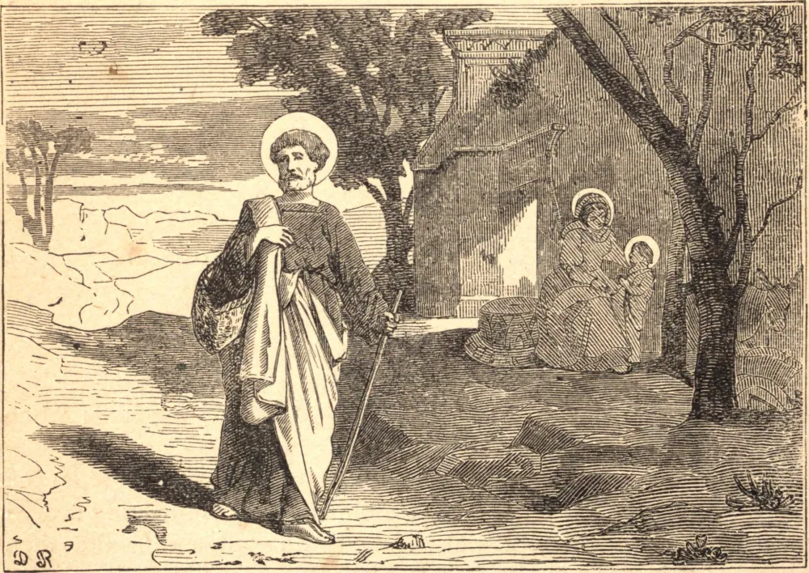

# 19 de março — SÃO JOSÉ, Esposo da Santíssima Virgem e Patrono da Igreja Universal

SÃO JOSÉ era de nascimento da real família de Davi, mas vivia em humilde obscuridade como carpinteiro quando Deus o elevou à mais alta santidade, e o tornou apto a ser o esposo de Sua Virgem Mãe, e pai adotivo e guardião do Verbo Encarnado. José, diz a Sagrada Escritura, era um homem justo; era inocente e puro, como convinha ao esposo de Maria; era brando e terno, como aquele digno de ser chamado o pai de Jesus; era prudente e amante do silêncio, como convinha ao senhor da santa casa; acima de tudo, era fiel e obediente aos chamamentos divinos. Sua convivência era antes com os anjos do que com os homens. Quando soube que Maria trazia em seu ventre o Senhor do céu, temeu tomá-la por esposa; mas um anjo o mandou não temer, e todas as dúvidas se desvaneceram. Quando Herodes buscou a vida do divino Infante, um anjo disse a José em sonho que fugisse com o Menino e Sua Mãe para o Egito. José logo se levantou e obedeceu. Esta súbita e inesperada fuga deve ter exposto José a muitos incômodos e sofrimentos em tão longa jornada com um pequeno menino e uma tenra virgem, sendo a maior parte do caminho por desertos e entre estrangeiros; contudo, ele não alega escusas, nem indaga em que tempo haveriam de retornar. São Crisóstomo observa que Deus trata assim a todos os Seus servos, enviando-lhes frequentes provações para purificar seus corações da ferrugem do amor-próprio, mas entremeando tempos de consolação. "José", diz ele, "está ansioso ao ver a Virgem grávida; um anjo afasta esse temor. Alegra-se com o nascimento do Menino, mas sucede-lhe um grande temor: o rei furioso busca destruir o Menino, e toda a cidade está em alvoroço para tirar-Lhe a vida. Segue-se a isto outra alegria, a adoração dos Magos; surge então uma nova dor: ordenam-lhe que fuja para um país estrangeiro e desconhecido, sem auxílio nem conhecidos." É opinião dos Padres que, ao entrarem no Egito, à presença do menino Jesus, todos os oráculos daquele país supersticioso emudeceram, e as estátuas de seus deuses tremeram e em muitos lugares caíram por terra. Os Padres atribuem também a esta santa visita a bênção espiritual derramada sobre aquele país, que o tornou por muitas eras fecundíssimo em Santos. Após a morte do Rei Herodes, da qual São José foi informado em outra visão, Deus ordenou-lhe que retornasse com o Menino e Sua Mãe à terra de Israel, o que nosso Santo prontamente obedeceu. Mas, quando chegou à Judeia, ouvindo que Arquelau havia sucedido a Herodes naquela parte do país, e receoso de que ele pudesse estar infectado com os vícios de seu pai, temeu por essa razão estabelecer-se ali, como de outro modo provavelmente teria feito para a educação do Menino; e, portanto, sendo dirigido por Deus em outra visão, retirou-se para os domínios de Herodes Antipas, na Galileia, à sua antiga habitação em Nazaré. São José, sendo um estrito observador da lei mosaica, em conformidade com sua determinação dirigia-se anualmente a Jerusalém para celebrar a Páscoa. Nosso Salvador, então no décimo segundo ano de Sua idade, acompanhou ali Seus pais. Tendo cumprido as cerimônias habituais da festa, retornavam com muitos de seus vizinhos e conhecidos rumo à Galileia; e, não duvidando em momento algum de que Jesus estivesse com alguns da companhia, viajaram por toda uma jornada de um dia antes de descobrirem que Ele não estava com eles. Mas, quando sobreveio a noite e não puderam ter notícias d'Ele entre seus parentes e conhecidos, eles, na mais profunda aflição, retornaram com a máxima presteza a Jerusalém. Após uma angustiosa busca de três dias, encontraram-No no Templo, discorrendo com os doutos doutores da lei, e fazendo-lhes tais perguntas que despertavam a admiração de todos os que O ouviam, e os deixavam atônitos com a maturidade de Seu entendimento; nem ficaram Seus pais menos surpresos nesta ocasião. Quando Sua Mãe Lhe disse com que dor e empenho O haviam buscado, e perguntou: "Filho, por que assim agiste conosco? eis que Teu pai e eu Te buscávamos em grande aflição de espírito", recebeu por resposta: "Por que me buscáveis? não sabíeis que devo ocupar-me das coisas de Meu Pai?" Mas, embora assim permanecendo no Templo sem o conhecimento de Seus pais, em todas as demais coisas Lhes era obediente, retornando com eles a Nazaré, e ali vivendo em toda submissão filial para com eles. Como nenhuma outra menção se faz de São José, ele deve ter morrido antes das bodas de Caná e do início do ministério de nosso divino Salvador. Não podemos duvidar de que teve a felicidade de Jesus e Maria assistirem à sua morte, orando junto a ele, auxiliando-o e consolando-o em seus últimos momentos; donde é particularmente invocado para a grande graça de uma boa morte e a presença espiritual de Jesus naquela hora.

## Reflexão

São José, a sombra do Pai Eterno sobre a terra, o protetor de Jesus em Seu lar em Nazaré, e amante de todas as crianças pelo amor do Santo Menino, deve ser o guardião e modelo escolhido de toda verdadeira família cristã.
