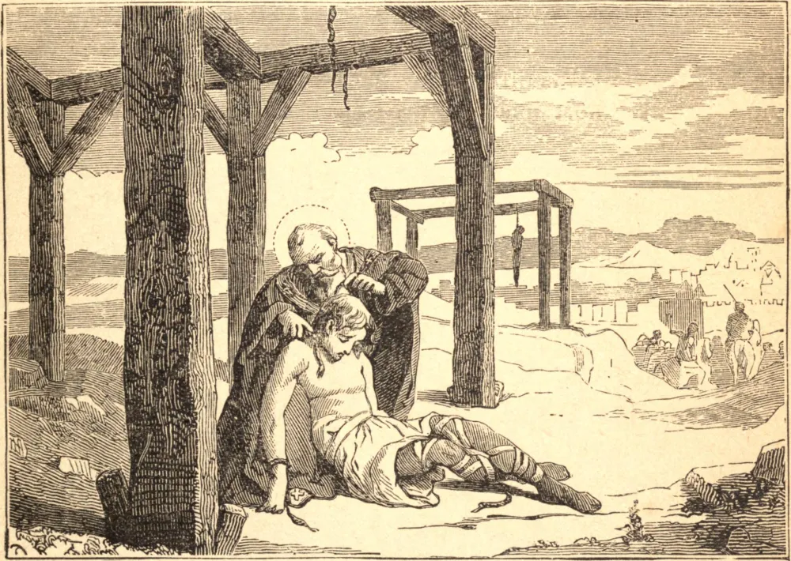

# 20 de março — SÃO WULFRANO, Arcebispo

Seu pai era um oficial nos exércitos do Rei Dagoberto, e o Santo passou alguns anos na corte do Rei Clotário III e de sua mãe, Santa Batildes, mas ocupava o coração somente com Deus, desprezando a grandeza mundana como vã e perigosa, e avançando diariamente na virtude. Sua propriedade de Maurilly concedeu-a à Abadia de Fontenelle, ou São Vandrille, na Normandia. Foi escolhido e consagrado Arcebispo de Sens em 682, diocese que governou por dois anos e meio com grande zelo e santidade.

Uma terna compaixão pela cegueira dos idólatras da Frísia, e o exemplo dos zelosos pregadores ingleses por aquelas partes, moveram-no a renunciar ao seu bispado, com devido conselho, e, após um retiro em Fontenelle, a entrar na Frísia na qualidade de um pobre sacerdote missionário. Batizou grandes multidões, entre elas um filho do Rei Radbod, e afastou o povo do bárbaro costume de sacrificar homens aos ídolos.

Em certa ocasião, tendo um certo Ovon sido escolhido como vítima de um sacrifício aos deuses pagãos, São Wulfrano suplicou fervorosamente sua vida ao Rei Radbod; mas o povo correu tumultuosamente ao palácio, e não permitiria o que chamavam um sacrilégio. Após muitas palavras, consentiram, mas sob a condição de que o Deus de Wulfrano salvasse a vida de Ovon. O Santo entregou-se à oração; o homem, depois de ter pendido na forca por duas horas, e de ter sido dado por morto, caiu por terra com o romper-se da corda; sendo encontrado vivo, foi entregue ao Santo, e tornou-se monge e sacerdote em Fontenelle. Wulfrano também milagrosamente resgatou duas crianças de serem afogadas em honra dos ídolos.

Radbod, que fora testemunha ocular deste último milagre, prometeu tornar-se cristão; mas, quando ia descer à pia batismal, perguntou onde estavam, no outro mundo, o grande número de seus antepassados e nobres. O Santo respondeu que o inferno é a porção de todos os que morrem culpados de idolatria; ao que o príncipe recusou ser batizado, dizendo que iria com o maior número. Este tirano enviou depois a São Willibrordo para tratar com ele de sua conversão, mas, antes da chegada do Santo, foi encontrado morto.

São Wulfrano retirou-se para Fontenelle a fim de preparar-se para a morte, e ali expirou no dia 20 de abril de 720.

**Reflexão**—Em toda época, a Igreja Católica é uma igreja missionária. Recebeu o mundo por sua herança, e em nossos próprios dias muitos missionários regaram com seu sangue as terras em que labutaram. Auxiliai a propagação da fé com esmolas, e acima de tudo com orações. Avivareis a vossa própria fé e ganhareis parte nos méritos do glorioso apostolado.
