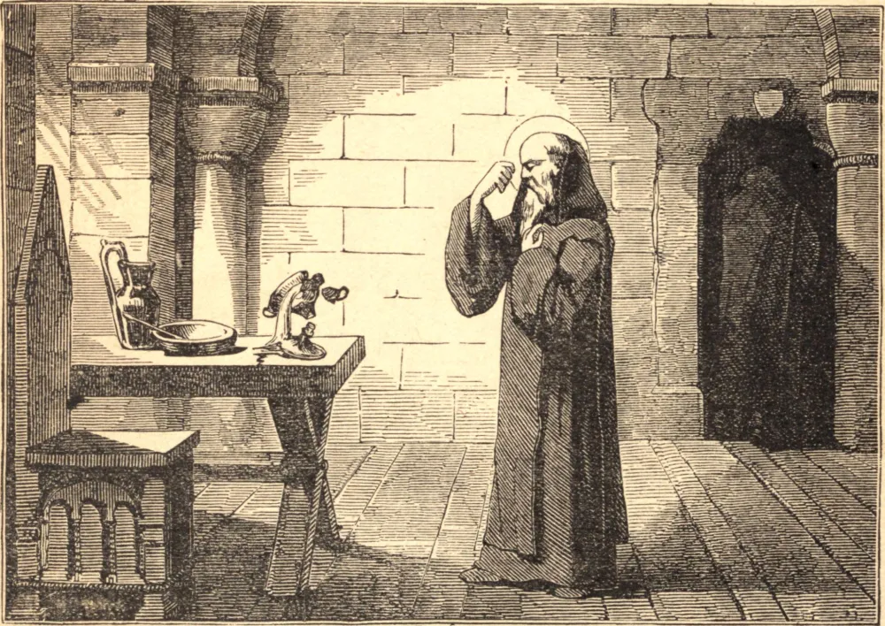

# 21 de março — SÃO BENTO, Abade

SÃO BENTO, abençoado pela graça e no nome, nasceu de uma nobre família italiana por volta de 480. Quando menino, foi enviado a Roma, e ali colocado nas escolas públicas. Assustado com a licenciosidade da juventude romana, fugiu para as desertas montanhas de Subiaco, e foi dirigido pelo Espírito Santo a uma gruta, profunda, escarpada e quase inacessível. Ali viveu por três anos, desconhecido de todos, salvo do santo monge Romano, que o revestiu com o hábito monástico e lhe trazia alimento. Mas a fama de sua santidade logo reuniu discípulos ao seu redor. O rigor de sua regra, contudo, atraiu-lhe o ódio de alguns dos monges, e um deles misturou veneno na bebida do abade; mas, quando o Santo fez o sinal da cruz sobre a taça envenenada, ela se partiu e caiu em pedaços por terra. Depois de ter edificado doze mosteiros em Subiaco, mudou-se para Monte Cassino, onde fundou uma abadia na qual escreveu sua regra e viveu até a morte.

Pela oração tudo realizava: operava milagres, via visões e profetizava. Um camponês, cujo menino acabara de morrer, correu angustiado a São Bento, clamando: "Devolve-me meu filho!" Os monges uniram-se ao pobre homem em suas súplicas; mas o Santo respondeu: "Tais milagres não nos cabe operar, mas aos bem-aventurados apóstolos. Por que quereis lançar sobre mim um fardo que a minha fraqueza não pode suportar?" Movido por fim de compaixão, ajoelhou-se e, prostrando-se sobre o corpo da criança, orou fervorosamente. Então, levantando-se, exclamou: "Não atentes, ó Senhor, para os meus pecados, mas para a fé deste homem, que deseja a vida de seu filho, e restitui ao corpo aquela alma que retiraste." Mal acabara de falar, o corpo da criança começou a tremer, e, tomando-a pela mão, restituiu-a viva a seu pai.

Seis dias antes de sua morte, ordenou que se abrisse sua sepultura, e adoeceu de uma febre. No sexto dia, pediu que o levassem à capela e, tendo recebido o corpo e o sangue de Cristo, com as mãos erguidas, e apoiando-se sobre um de seus discípulos, expirou serenamente em oração no dia 21 de março de 543.

**Reflexão**—Os Santos nunca temeram empreender obra alguma, por mais árdua que fosse, por Deus, porque, desconfiando de si mesmos, confiavam para o auxílio e o sustento inteiramente na oração.
