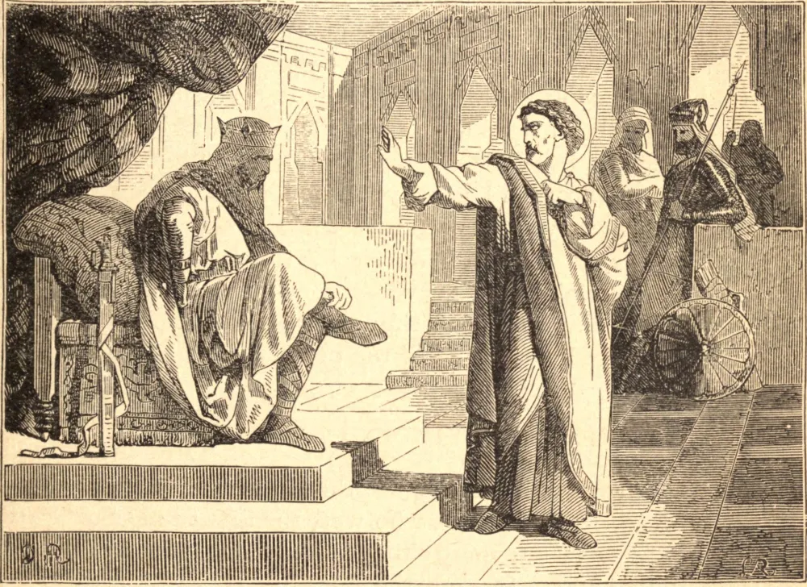

# 23 de março — SANTOS VITORIANO E OUTROS, Mártires

HUNERICO, o rei ariano dos vândalos na África, sucedeu a seu pai Genserico em 477. Comportou-se a princípio com moderação para com os católicos, mas em 480 começou uma grave perseguição contra o clero e as santas virgens, que em 484 se tornou geral, e vastos números de católicos foram mortos. Vitoriano, um dos principais senhores do reino, fora feito governador de Cartago, com o título romano de Procônsul. Era o súdito mais rico do rei, que depositava nele grande confiança, e ele sempre se conduzira com uma fidelidade inviolável. O rei, depois de ter publicado seus cruéis editos, enviou uma mensagem ao procônsul, prometendo, se ele se conformasse à sua religião, acumular sobre ele as maiores riquezas e as mais altas honras que estivessem no poder de um príncipe conceder. O procônsul, que em meio às pompas reluzentes do mundo perfeitamente compreendia a sua vacuidade, deu esta generosa resposta: "Dizei ao rei que confio em Cristo. Sua Majestade pode condenar-me a quaisquer tormentos, mas jamais consentirei em renunciar à Igreja Católica, na qual fui batizado. Ainda que não houvesse vida após esta, jamais seria ingrato e pérfido para com Deus, que me concedeu a felicidade de conhecê-Lo, e me outorgou Suas mais preciosas graças." O tirano enfureceu-se com esta resposta, e não se podem imaginar os tormentos que ele fez o Santo padecer. Vitoriano sofreu-os com alegria, e em meio a eles consumou seu glorioso martírio. O Martirológio Romano associa a ele neste dia quatro outros que foram coroados na mesma perseguição. Dois irmãos, que foram presos pela fé, haviam prometido um ao outro, se possível, morrer juntos; e suplicaram a Deus, como um favor, que pudessem ambos sofrer os mesmos tormentos. Os perseguidores suspenderam-nos no ar com grandes pesos aos pés. Um deles, sob o excesso da dor, suplicou ser baixado para um pouco de alívio. Seu irmão, temendo que isto pudesse movê-lo a negar a fé, clamou do potro: "Deus não permita, querido irmão, que peças tal coisa. É isto o que prometemos a Jesus Cristo?" O outro de tal modo se animou maravilhosamente que clamou: "Não, não; não peço ser solto; aumentai meus tormentos, exercei todas as vossas crueldades até que se esgotem sobre mim." Foram então queimados com placas de ferro em brasa, e atormentados por tanto tempo que os carrascos por fim os deixaram, dizendo: "Todos seguem o seu exemplo! ninguém mais abraça a nossa religião." Isto disseram principalmente porque, não obstante terem estes irmãos sido tão longa e tão gravemente atormentados, não se viam neles cicatrizes nem contusões. Dois mercadores de Cartago, que ambos traziam o nome de Frumêncio, sofreram o martírio mais ou menos pela mesma época. Entre muitos gloriosos confessores daquele tempo, um certo Liberato, um eminente médico, foi enviado ao desterro com sua esposa. Só se afligia ao ver seus filhos pequeninos arrancados dele. Sua esposa conteve-lhe as lágrimas com estas palavras: "Não penses mais neles: o próprio Jesus Cristo cuidará deles e protegerá suas almas." Enquanto estava na prisão, foi-lhe dito que seu marido se havia conformado. Em consequência, quando o encontrou perante o juiz no tribunal, censurou-o em pleno tribunal por ter vilmente abandonado a Deus; mas descobriu, por sua resposta, que um embuste lhe fora pregado para enganá-la e levá-la à sua ruína. Doze crianças pequenas, quando arrastadas pelos perseguidores, agarravam-se aos joelhos de seus companheiros até serem arrancadas com violência. Foram cruelissimamente espancadas e açoitadas todos os dias por longo tempo; contudo, pela graça de Deus, cada uma delas perseverou na fé até o fim da perseguição.
