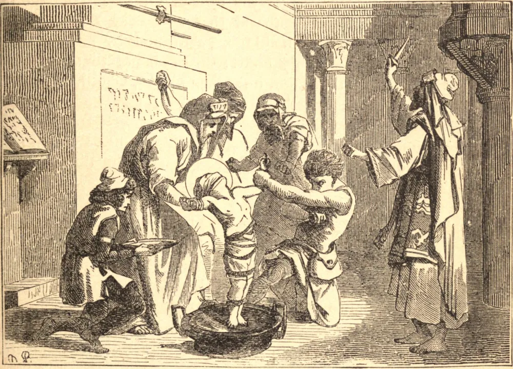

# 24 de março — SÃO SIMÃO, Mártir Infante

"SALVE, flores dos mártires!", canta a Igreja em seu Ofício dos Santos Inocentes, que foram os primeiros a morrer por Cristo; e em toda época meras crianças e infantes confessaram gloriosamente o Seu nome. Em 1472, os judeus na cidade de Trento resolveram desafogar seu ódio contra o Crucificado matando uma criança cristã na Páscoa que se aproximava; e Tobias, um dos seus, foi designado para enredar uma vítima. Encontrou um menino vivaz e sorridente chamado Simão brincando fora de sua casa, sem ninguém a vigiá-lo. Tobias deu uns tapinhas na face do pequenino, e o persuadiu a tomar-lhe a mão. O menino, que não tinha dois anos de idade, assim o fez; mas começou a chamar e a chorar pela mãe quando se viu sendo conduzido para longe de casa. Então Tobias deu-lhe uma moeda reluzente para olhar e, com muitas amáveis carícias, silenciou-lhe a dor, e conduziu-o em segurança à sua casa. À meia-noite da Quinta-feira Santa começou a obra de carnificina. Tendo-lhe amordaçado a boca, mantiveram seus braços em forma de cruz, enquanto trespassavam seu tenro corpo com sovelas e furadores, em escárnio blasfemo dos sofrimentos de Jesus Cristo. Após uma hora de tortura, o pequeno mártir ergueu os olhos ao céu e entregou sua alma inocente. Os judeus lançaram seu corpo ao rio; mas seu crime foi descoberto e punido, ao passo que as santas relíquias foram entronizadas na Igreja de São Pedro em Trento, onde operaram muitos milagres.

GUILHERME DE NORWICH é outra destas crianças mártires. Seus pais eram simples gente do campo, mas sua mãe foi instruída por uma visão a esperar um Santo em seu filho. Quando menino, jejuava três vezes por semana e orava constantemente, e tinha apenas doze anos de idade, sendo aprendiz de um curtidor em Norwich, quando ganhou sua coroa. Pouco antes da Páscoa de 1137, foi atraído à casa de um judeu, e ali foi amordaçado, amarrado e crucificado em ódio a Cristo. Cinco anos se passaram antes que o corpo fosse encontrado, quando foi sepultado como uma relíquia de santo no adro da catedral. Uma roseira plantada bem perto floresceu milagrosamente em pleno inverno, e muitos enfermos foram curados em seu santuário.[^1]

## Reflexão

Aprendei dos mártires infantes que, por mais fracos que sejais, podeis ainda sofrer por amor de Cristo.

[^1]: Não se deve pensar que estes casos singulares e extraordinários comprovem a acusação de que a matança de crianças cristãs faz parte do ritual judaico. Esta acusação contra os judeus já foi provada ser falsa.
