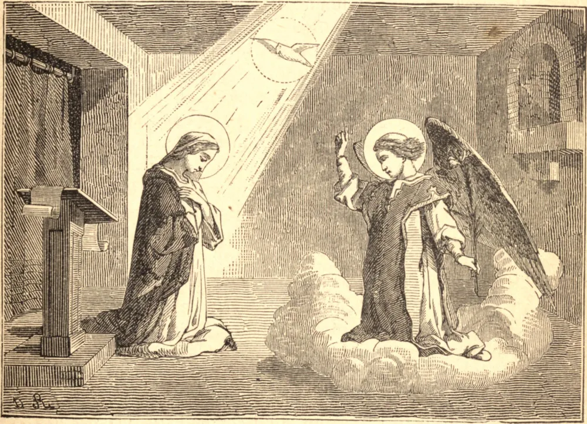

# 25 de março — A ANUNCIAÇÃO DA SANTÍSSIMA VIRGEM MARIA

ESTA grande festividade toma seu nome das felizes novas trazidas pelo anjo Gabriel à Santíssima Virgem, concernentes à Encarnação do Filho de Deus. Comemora a mais importante embaixada que jamais se conheceu: uma embaixada enviada pelo Rei dos reis, realizada por um dos principais príncipes de Sua corte celestial; dirigida, não aos grandes desta terra, mas a uma pobre e desconhecida virgem, que, sendo dotada da mais angélica pureza de alma e de corpo, sendo ademais perfeitamente humilde e devotada a Deus, era maior aos Seus olhos do que o mais poderoso monarca do mundo. Quando o Filho de Deus se fez homem, poderia ter assumido a nossa natureza sem a cooperação de criatura alguma; mas aprouve-Lhe nascer de uma mulher. Na escolha daquela que elevou a esta mais sublime de todas as dignidades, pousou Seus olhos sobre aquela que, pelas riquezas de Sua graça e virtudes, era de todas a mais santa e a mais perfeita. O desígnio desta embaixada do arcanjo é dar um Salvador ao mundo, uma vítima de propiciação ao pecador, um modelo aos justos, um filho a esta Virgem, permanecendo ela ainda virgem, e uma nova natureza ao Filho de Deus, a natureza do homem, capaz de sofrer dor e angústia a fim de satisfazer à justiça de Deus por nossas transgressões.

Quando o anjo apareceu a Maria e a saudou, a Santíssima Virgem perturbou-se: não com a aparição do anjo, diz Santo Ambrósio, pois as visões celestiais e a convivência com os espíritos bem-aventurados lhe haviam sido familiares; mas o que a alarmou, diz ele, foi o anjo aparecer em forma humana, sob a figura de um jovem. O que pode ter aumentado seu sobressalto na ocasião foi ele dirigir-se a ela com palavras de louvor. Maria, resguardada por sua modéstia, fica em confusão diante de expressões desta espécie, e teme a menor aparência de uma lisonja enganadora. Tão altas comendas a tornam cautelosa quanto ao modo de responder, até que em silêncio tenha considerado mais plenamente a matéria: "Ela revolvia em sua mente", diz São Lucas, "que espécie de saudação seria esta." Ah, que número de almas inocentes têm sido corrompidas por falta de usar as semelhantes precauções!

O anjo, para acalmá-la, diz: "Não temas, Maria, pois achaste graça diante de Deus." Informa-a então de que há de conceber e dar à luz um Filho cujo nome será Jesus, que será grande, e o Filho do Altíssimo, e possuidor do trono de Davi, seu ilustre antepassado. Maria, por um justo cuidado de saber como pode cumprir a vontade de Deus sem prejuízo de seu voto de virgindade, indaga: "Como se fará isto?" Nem dá ela o seu consentimento até que o mensageiro celestial a inteire de que há de ser obra do Espírito Santo, que, ao torná-la fecunda, não atentará no mínimo contra a sua pureza virginal.

Em submissão, portanto, à vontade de Deus, sem nenhuma outra indagação, ela exprime o seu assentimento nestas humildes mas poderosas palavras: "Eis aqui a serva do Senhor; faça-se em mim segundo a Tua palavra." Que fé e que confiança exprime a sua resposta! que profunda humildade e que perfeita obediência!

## Reflexão

Do exemplo da Santíssima Virgem neste mistério, quão ardente amor devemos conceber pela pureza e pela humildade! O Espírito Santo é convidado pela pureza a habitar nas almas, mas é expulso pela imundície do vício contrário. A humildade é o fundamento da vida espiritual. Por ela foi Maria preparada para as graças extraordinárias e todas as virtudes com que foi enriquecida, e para a eminente dignidade de Mãe de Deus.
