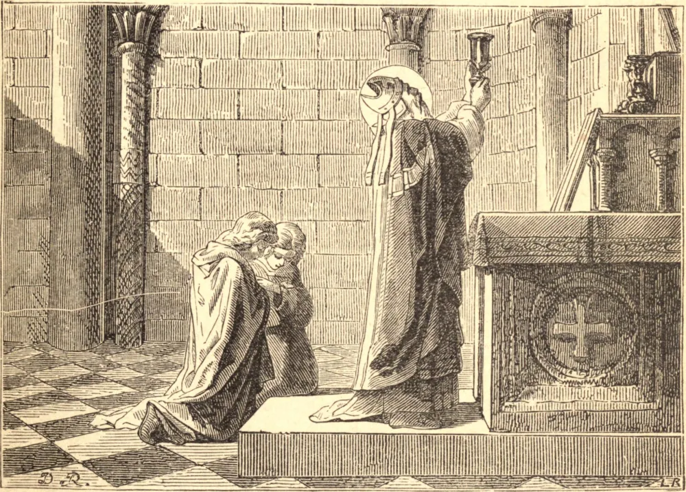

# 26 de março — SÃO LUDGERO, Bispo

SÃO LUDGERO nasceu na Frísia por volta do ano 743. Seu pai, um nobre de primeira hierarquia, a pedido da própria criança, confiou-o ainda muito jovem aos cuidados de São Gregório, o discípulo de São Bonifácio, e a seus sucessores no governo da sé de Utrecht. Gregório educou-o em seu mosteiro e deu-lhe a tonsura clerical. Ludgero, desejoso de maior aperfeiçoamento, passou à Inglaterra e ali viveu quatro anos e meio sob a direção de Alcuíno, que era reitor de uma famosa escola em York. Em 773 regressou à pátria, e, falecendo São Gregório em 776, seu sucessor, Albérico, compeliu o nosso Santo a receber a santa ordem do sacerdócio, e empregou-o por vários anos a pregar a Palavra de Deus na Frísia, onde converteu grande número de pessoas, fundou vários mosteiros e edificou muitas igrejas.

Como os saxões pagãos assolavam o país, Ludgero viajou a Roma para consultar o Papa Adriano II sobre que rumo tomar e o que ele julgava que Deus dele requeria. Retirou-se então por três anos e meio a Monte Cassino, onde vestiu o hábito da Ordem e se conformou à prática da regra durante sua estada, mas não fez votos religiosos. Em 787, Carlos Magno venceu os saxões e conquistou a Frísia e a costa do Oceano Germânico até a Dinamarca. Ouvindo isto, Ludgero regressou à Frísia Oriental, onde converteu os saxões à Fé, como fez também na província da Vestfália. Fundou o mosteiro de Werden, a vinte e nove milhas de Colônia. Em 802, Hildebaldo, Arcebispo de Colônia, não levando em conta sua firme resistência, ordenou-o Bispo de Münster. Anexou à sua diocese cinco cantões da Frísia que havia convertido, e fundou também o mosteiro de Helmstad no ducado de Brunswick.

Sendo acusado perante o Imperador Carlos Magno de desperdiçar suas rendas e negligenciar o embelezamento das igrejas, este príncipe ordenou-lhe que comparecesse à corte. Na manhã seguinte à sua chegada, o camareiro do imperador trouxe-lhe o aviso de que sua presença era requerida. O Santo, estando então em oração, disse ao oficial que o seguiria assim que as houvesse terminado. Foi chamado três vezes seguidas antes de estar pronto, o que os cortesãos representaram como um desprezo a Sua Majestade, e o imperador, com certa emoção, perguntou-lhe por que o fizera esperar tanto, embora o tivesse mandado chamar tantas vezes. O bispo respondeu que, embora tivesse o mais profundo respeito por Sua Majestade, Deus estava infinitamente acima dele; que, enquanto estamos ocupados com Ele, é nosso dever esquecer tudo o mais. Esta resposta causou tal impressão no imperador que ele o despediu com honra e desonrou seus acusadores.

São Ludgero foi favorecido com os dons dos milagres e da profecia. Sua última enfermidade, embora violenta, não o impediu de continuar suas funções até o último dia de sua vida, que foi o Domingo da Paixão, dia em que pregou bem cedo pela manhã, celebrou Missa por volta das nove, e pregou novamente antes do anoitecer, predizendo aos que o cercavam que morreria na noite seguinte, e fixando um lugar em seu mosteiro de Werden onde escolheu ser sepultado. Morreu, com efeito, no dia 26 de março, à meia-noite.

**Reflexão**—A oração é uma ação tão sublime e sobrenatural que a Igreja, em suas Horas Canônicas, ensina-nos a iniciá-la com uma fervorosa petição de graça para realizá-la bem. Que insolência e zombaria é juntar a esta petição um desrespeito manifesto e a negligência de todas as precauções necessárias contra as distrações! Jamais deveríamos comparecer diante de Deus, para Lhe render nossas homenagens ou súplicas, sem tremor, e sem estar surdos a todas as criaturas e fechar todos os nossos sentidos a todo objeto que possa distrair nossas mentes de Deus.
