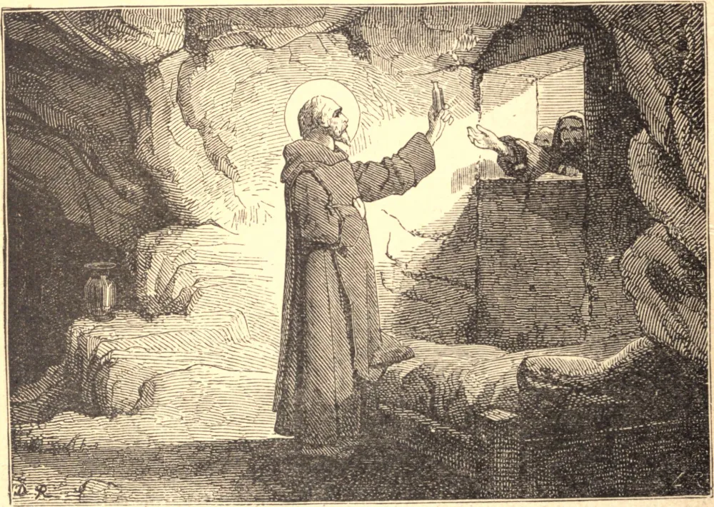

# 27 de março — SÃO JOÃO DO EGITO

ATÉ os vinte e cinco anos, João trabalhou como carpinteiro com seu pai. Então, sentindo um chamado de Deus, deixou o mundo e confiou-se a um santo solitário no deserto. Seu mestre provou-lhe o espírito com muitas ordens desarrazoadas, mandando-o rolar duras rochas, cuidar de árvores mortas, e coisas semelhantes. João obedecia em tudo com a simplicidade de uma criança. Após um cuidadoso adestramento de dezesseis anos, retirou-se para o alto de um íngreme penhasco, a fim de pensar somente em Deus e em sua alma. Quanto mais se conhecia, mais desconfiava de si mesmo. Por isso, durante os últimos cinquenta anos, nunca viu mulheres, e raras vezes homens.

O fruto desta vigilância e pureza foi tríplice: uma santa alegria e jovialidade que consolava todos os que conversavam com ele; perfeita obediência aos superiores; e, em retribuição a isto, autoridade sobre as criaturas, que ele abandonara pelo Criador. Santo Agostinho conta-nos que ele apareceu em visão a uma santa mulher, cuja vista havia restaurado, para evitar vê-la face a face. Os demônios o assaltavam continuamente, mas João nunca cessava sua oração. De suas longas conversas com Deus, voltava-se para os homens com os dons da cura e da profecia. Duas vezes por semana falava por uma janela com os que vinham a ele, abençoando óleo para seus enfermos e predizendo coisas futuras. Um diácono veio a ele disfarçado, e ele reverentemente lhe beijou a mão. Ao Imperador Teodósio predisse suas futuras vitórias e o tempo de sua morte.

Os três últimos dias de sua vida João deu-os inteiramente a Deus: no terceiro, foi encontrado de joelhos como em oração, mas sua alma estava com os bem-aventurados. Morreu em 394.

**Reflexão**—Os Santos examinam-se à luz das perfeições de Deus, e fazem penitência. Nós julgamos nossa conduta pelo padrão dos outros homens, e ficamos satisfeitos com ela. Contudo, é unicamente pela santidade divina que seremos julgados quando morrermos.
