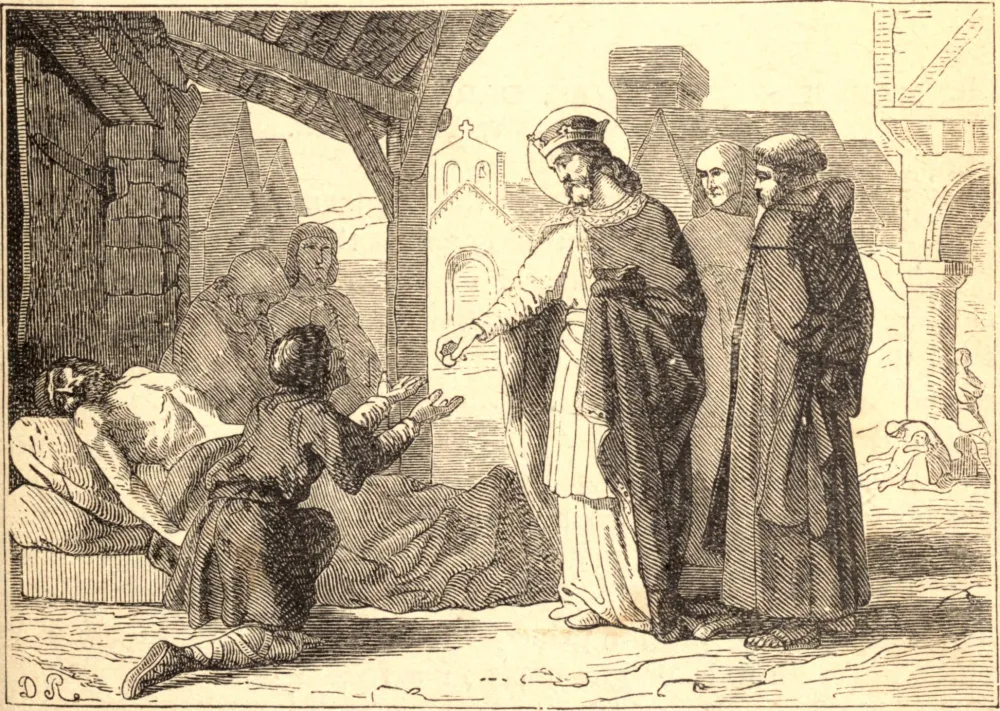

# 28 de março — SÃO GONTRÃO, Rei

SÃO GONTRÃO foi filho do Rei Clotário, e neto de Clóvis I e de Santa Clotilde. Sendo o segundo filho, enquanto seus irmãos Cariberto reinava em Paris, e Sigeberto na Austrásia, residindo em Metz, ele foi coroado rei de Orleans e da Borgonha em 561, fazendo de Chalons sua capital. Quando compelido a pegar em armas contra seus ambiciosos irmãos e os lombardos, não fez outro uso de suas vitórias, sob a condução de um valoroso general chamado Mommol, senão dar paz a seus domínios.

Os crimes em que os costumes bárbaros de sua nação o envolveram, ele os apagou com lágrimas de arrependimento. A prosperidade de seu reinado, tanto na paz como na guerra, condena os que pensam que a política humana não pode ser modelada pelas máximas do Evangelho, ao passo que nada pode tornar um governo mais florescente. Sempre tratou os pastores da Igreja com respeito e veneração. Foi o protetor dos oprimidos, e o terno pai de seus súditos. Dava a maior atenção ao cuidado dos enfermos. Jejuava, orava, chorava, e oferecia-se a Deus noite e dia como uma vítima pronta a ser sacrificada no altar de Sua justiça, para desviar a indignação d'Ele, que cria ter ele próprio provocado e atraído sobre seu povo inocente. Era um severo punidor dos crimes de seus oficiais e de outros, e, por muitas salutares disposições, refreava a bárbara licenciosidade de suas tropas; mas nenhum homem estava mais pronto a perdoar as ofensas contra a própria pessoa. Com magnificência régia, edificou e dotou muitas igrejas e mosteiros.

Este bom rei morreu no dia 23 de março de 593, no sexagésimo oitavo ano de sua idade, tendo reinado trinta e um anos e alguns meses.

**Reflexão**—Não há meio de salvação mais seguro do que a prática da misericórdia, pois Nosso Senhor o disse: "Bem-aventurados os misericordiosos, porque alcançarão misericórdia."
