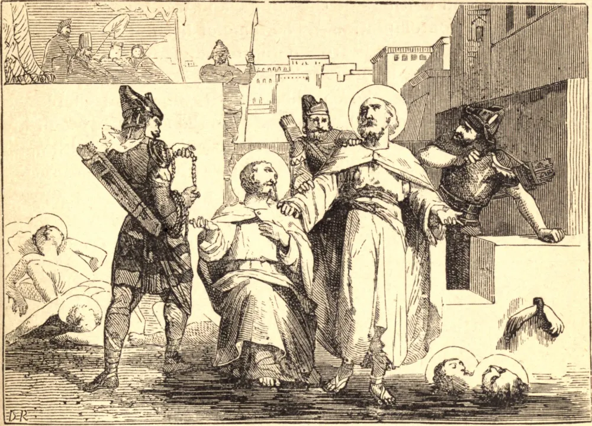

# 29 de março — SÃO JONAS, SÃO BARAQUÍSIO e seus Companheiros, Mártires

O REI SAPOR, da Pérsia, no décimo oitavo ano de seu reinado, levantou uma sangrenta perseguição contra os cristãos, e devastou suas igrejas e mosteiros. Jonas e Baraquísio, dois irmãos da cidade de Bete-Asa, ouvindo que vários cristãos jaziam sob sentença de morte em Hubaham, para lá se dirigiram a fim de animá-los e servi-los. Nove daquele número receberam a coroa do martírio. Após sua execução, Jonas e Baraquísio foram presos por os terem exortado a morrer.

O presidente rogou aos dois irmãos que obedecessem ao rei da Pérsia, e que adorassem o sol, a lua, o fogo e a água. A resposta deles foi que era mais razoável obedecer ao imortal Rei do céu e da terra do que a um príncipe mortal. Jonas foi espancado com cacetes nodosos e com varas, e em seguida posto num lago gelado, com uma corda atada ao pé. A Baraquísio aplicaram duas placas de ferro em brasa e dois martelos em brasa debaixo de cada braço, e despejaram chumbo derretido em suas narinas e olhos; depois disso, foi levado à prisão, e ali pendurado por um pé. Apesar destes cruéis tormentos, os dois irmãos permaneceram firmes na Fé. Foram então inventados novos e mais horríveis tormentos, sob os quais por fim entregaram suas vidas, enquanto suas almas puras voavam para o céu, ali a ganhar a coroa do martírio, que tão fielmente haviam conquistado.

**Reflexão**—Aqueles poderosos motivos que sustentaram os mártires sob os mais agudos tormentos devem inspirar-nos paciência, resignação e santa alegria na enfermidade e em todas as cruzes ou provações. Nada é mais heroico na prática da virtude cristã, nada mais precioso aos olhos de Deus, do que o sacrifício da paciência, da submissão, da constante fidelidade e da caridade num estado de sofrimento.
