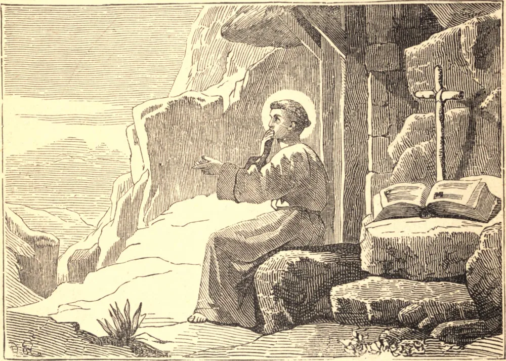

# 30 de março — SÃO JOÃO CLÍMACO

JOÃO fez, ainda jovem, tal progresso no saber que foi chamado o Escolástico. Aos dezesseis anos de idade, afastou-se do brilhante futuro que diante dele se estendia, e retirou-se ao Monte Sinai, onde se pôs sob a direção de um santo monge. Nunca houve noviço mais fervoroso, mais incansável em seus esforços pelo domínio de si mesmo. Após quatro anos, fez os votos, e um ancião abade predisse que ele seria um dia uma das maiores luzes da Igreja.

Dezenove anos depois, com a morte de seu diretor, retirou-se a uma solidão mais profunda, onde estudou as vidas e os escritos dos Santos, e foi elevado a uma altura incomum de contemplação. A fama de sua santidade e de sua sabedoria prática atraía multidões ao seu redor em busca de conselho e consolação. Para seu maior proveito, visitou as solidões do Egito.

Aos setenta e cinco anos foi escolhido abade do Monte Sinai, e ali "habitou no monte de Deus, e tirou do rico tesouro de seu coração inestimáveis riquezas de doutrina, que derramou com admirável abundância e bênção." Foi induzido por um irmão abade a escrever as regras pelas quais havia guiado sua vida; e seu livro chamado *Climax*, ou Escada da Perfeição, tem sido apreciado em todas as épocas por sua sabedoria, sua clareza e sua unção. Ao cabo de quatro anos, já não pôde suportar as honras e distrações de seu ofício, e retirou-se à sua solidão, onde morreu, em 605.

**Reflexão**—"Não afastes de ti, meu irmão", diz a *Imitação de Cristo*, "a segura esperança de alcançar a vida espiritual; ainda tens o tempo e os meios."
