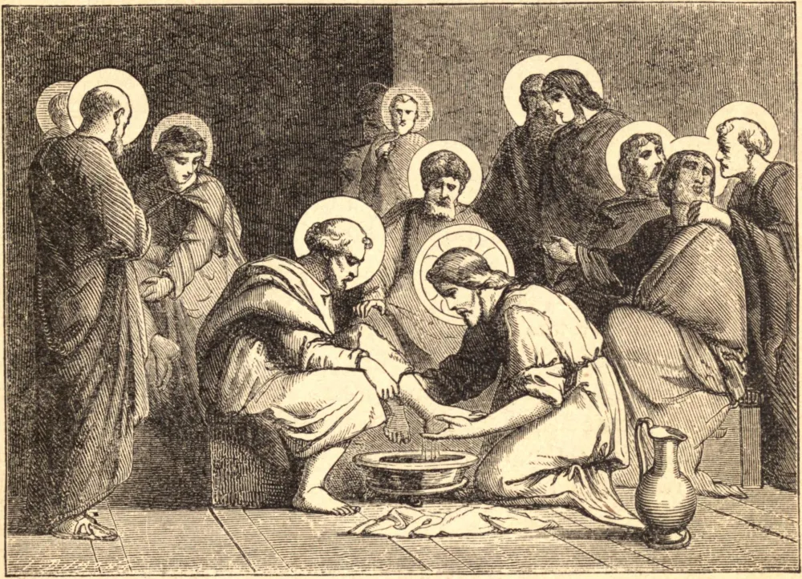

# Quinta-feira Santa

Na quinta-feira, véspera da Paixão, Jesus Cristo tomou o pão e, tendo-o abençoado, partiu-o e distribuiu-o aos seus apóstolos, dizendo-lhes: "Tomai e comei: ESTE é o MEU CORPO, que será entregue por vós." Tomando então o cálice, abençoou-o e deu-lho, dizendo: "Bebei todos deste, pois este é o cálice do meu sangue, que será derramado por vós." Acrescentou depois: "Fazei isto em memória de mim." Estas palavras, em toda a sua precisão, simplicidade e clareza, contêm a instituição do adorável Sacramento da Eucaristia, uma prova irrefragável da Presença Real de Jesus Cristo neste Sacramento, e a demonstração de sua perpetuidade na Igreja.

Mas, antes de entregar-nos a raciocínios, exponhamos brevemente o principal efeito. Jesus Cristo, antes de instituí-lo, havia dito que este sacramento comunicaria a vida eterna àqueles que o recebessem; e isto, ao menos sob um aspecto, e tanto quanto é dado ao homem compreender os mistérios de Deus, é inteligível. O pecado havia implantado no homem o gérmen da morte e do vício. Por causa de sua desobediência, o homem tornara-se incapaz do bem, ou mesmo de um pensamento santo, como nos diz o grande Apóstolo. Ora, em Deus está a fonte do ser, da vida, do bem, da virtude e de toda excelência. Deus, comunicando-Se substancialmente ao homem por meio deste augusto sacramento, implanta o gérmen da imortalidade e da virtude.

O homem, se limitado às suas próprias forças, não poderia sequer conceber um modo útil de tornar-se virtuoso, pois donde haveria de tirar o princípio da virtude e o meio de pô-lo em prática? Teria, por conseguinte, de incorrer na perda eterna, visto que a salvação sem a virtude é coisa de todo impossível. Mas, uma vez impregnado do princípio da graça por uma íntima união com Deus, basta-lhe deixá-lo desenvolver-se e cultivar a boa semente nele lançada. Assim faz o diamante, de si mesmo incolor e opaco, que absorve a luz quando a ela exposto, tornando-se um cintilante centro de luz, e brilhando com radiante esplendor. Quanto mais vívida a luz, tanto mais brilhantemente brilhará o diamante, se for puro. Do mesmo modo, quanto mais o homem se lança na Divina substância, tanto mais por ela será inundado pela sagrada comunhão; tanto mais potente também se tornará a sua vida em virtudes fortes e múltiplas, e, por conseguinte, em seguros títulos à salvação.

**Reflexão**—Com que respeito, amor e ardor não devemos nós receber este divino alimento, "que faz viver para sempre"!
