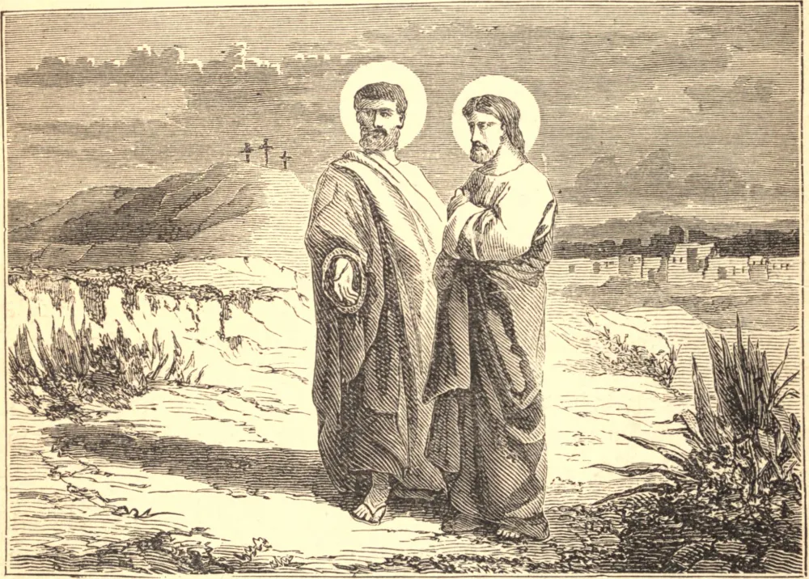

# 1 de maio — SÃO FILIPE e SÃO TIAGO, Apóstolos

FILIPE foi um dos primeiros discípulos escolhidos por Cristo. No caminho da Judeia para a Galileia, Nosso Senhor encontrou Filipe, e disse: "Segue-me." Filipe imediatamente obedeceu; e então, em seu zelo e caridade, procurou ganhar também Natanael, dizendo: "Encontramos Aquele de quem Moisés e os profetas escreveram, Jesus de Nazaré;" e quando Natanael, admirado, perguntou: "Pode vir alguma coisa boa de Nazaré?" Filipe respondeu simplesmente: "Vem e vê," e levou-o a Jesus. Outra frase característica deste apóstolo nos é conservada por São João. Cristo, em Seu último discurso, havia falado de Seu Pai; e Filipe exclamou, no fervor de sua sede de Deus: "Senhor, mostra-nos o Pai, e isto nos basta."

São Tiago Menor, autor de uma epístola inspirada, era também um dos Doze. São Paulo nos diz que ele foi favorecido por uma aparição especial de Cristo após a Ressurreição. Na dispersão dos apóstolos entre as nações, São Tiago ficou como Bispo de Jerusalém; e até os judeus tinham em tão alta veneração a sua pureza, mortificação e oração, que o chamavam de o Justo. O mais antigo dos historiadores da Igreja transmitiu muitas tradições da santidade de São Tiago. Foi sempre virgem, diz Hegésipo, e consagrado a Deus. Não bebia vinho, não usava sandálias nos pés, e apenas uma única veste sobre o corpo. Prostrava-se tanto em oração que a pele de seus joelhos endureceu como o casco de um camelo. Os judeus, diz-se, costumavam, por respeito, tocar a orla de sua veste. Era de fato uma prova viva de suas próprias palavras: "A sabedoria que vem do alto é primeiramente casta, depois pacífica, modesta, cheia de misericórdia e de bons frutos." Sentou-se ao lado de São Pedro e São Paulo no Concílio de Jerusalém; e quando São Paulo, em tempo posterior, escapou ao furor dos judeus apelando para César, o povo vingou-se em Tiago, e, clamando: "O justo errou," apedrejou-o até a morte.

## Reflexão

A Igreja comemora no mesmo dia São Filipe e São Tiago, cujos corpos jazem lado a lado em Roma. Eles nos representam dois aspectos da santidade cristã. O primeiro prega a fé, o segundo as obras; um as santas aspirações, o outro a pureza de coração.
