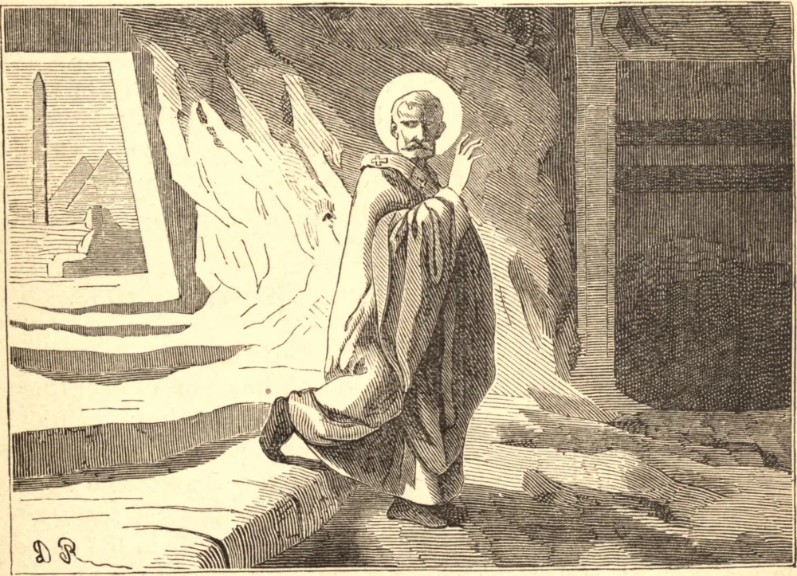

# 2 de maio — SANTO ATANÁSIO, Bispo

ATANÁSIO nasceu no Egito por volta do fim do terceiro século, e foi desde a juventude piedoso, instruído e profundamente versado nas sagradas escrituras, como convinha a quem Deus havia escolhido para ser o campeão e defensor de Sua Igreja contra a heresia ariana. Embora fosse apenas diácono, foi escolhido por seu bispo para acompanhá-lo ao Concílio de Niceia, em 325, e atraiu a atenção de todos pela erudição e habilidade com que defendeu a fé. Poucos meses depois, tornou-se Patriarca de Alexandria, e por quarenta e seis anos suportou, muitas vezes quase sozinho, todo o peso do assalto ariano.

Diante da recusa do Santo em readmitir Ário à comunhão católica, o imperador ordenou ao Patriarca de Constantinopla que o fizesse. O miserável heresiarca prestou juramento de que sempre havia crido como crê a Igreja; e o patriarca, após em vão empregar todo esforço para mover o imperador, recorreu ao jejum e à oração, para que Deus afastasse da Igreja o terrível sacrilégio. Chegou o dia da entrada solene de Ário na grande igreja de Santa Sofia. O heresiarca e seu partido puseram-se a caminho alegres e em triunfo. Mas, antes que ele alcançasse a igreja, a morte feriu-o de modo súbito e terrível, e o temido sacrilégio foi evitado.

Santo Atanásio permaneceu inabalável diante de quatro imperadores romanos; foi banido cinco vezes; foi alvo de todo insulto, calúnia e injustiça que os arianos puderam imaginar, e viveu em constante perigo de morte. Embora firme como o diamante na defesa da Fé, era manso e humilde, agradável e cativante no trato, amado por seu rebanho, incansável nos trabalhos, na oração, nas mortificações e no zelo pelas almas.

No ano de 373, sua tempestuosa vida encerrou-se em paz, antes porque seu povo assim o quis do que porque seus inimigos estivessem cansados de persegui-lo. Deixou à Igreja a Fé inteira e antiga, defendida e explicada em escritos ricos de pensamento e erudição, claros, agudos e majestosos na expressão. É honrado como um dos maiores Doutores da Igreja.

**Reflexão**—A Fé Católica, diz Santo Agostinho, é muito mais preciosa do que todas as riquezas e tesouros da terra; mais gloriosa e maior do que todas as suas honras, todas as suas posses. É ela que salva os pecadores, dá luz aos cegos, restaura os penitentes, aperfeiçoa os justos, e é a coroa dos mártires.
