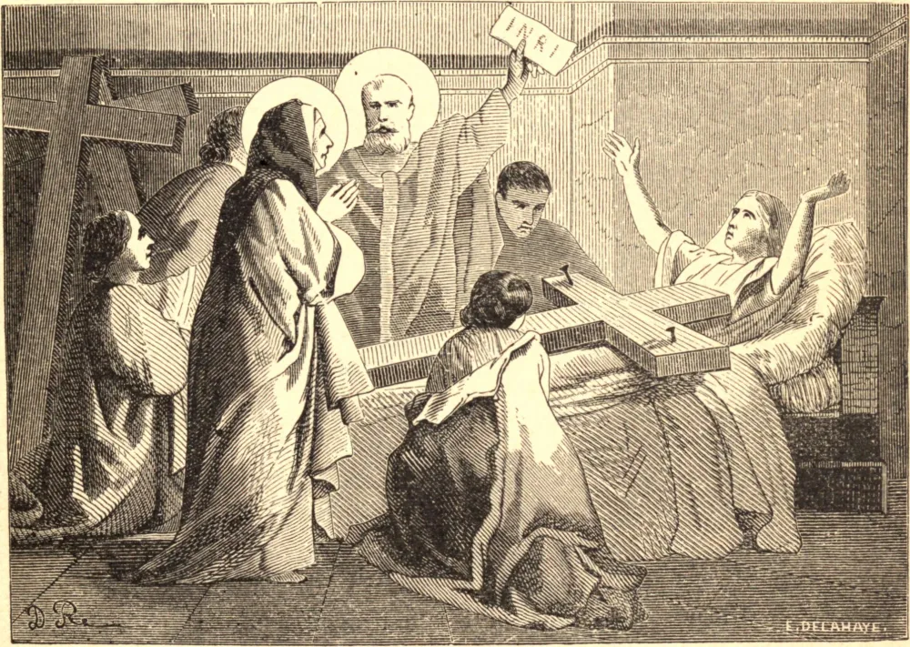

# 3 de maio — A DESCOBERTA DA SANTA CRUZ

TENDO Deus restaurado a paz à Sua Igreja, elevando Constantino, o Grande, ao trono imperial, aquele piedoso príncipe, que havia triunfado sobre seus inimigos pelo milagroso poder da cruz, desejava muito exprimir sua veneração pelos lugares santos que haviam sido honrados e santificados pela presença e pelos sofrimentos de nosso bendito Redentor na terra, e por isso resolveu edificar uma igreja magnífica na cidade de Jerusalém. Santa Helena, mãe do imperador, desejando visitar ali os lugares santos, empreendeu uma viagem à Palestina em 326, embora então tivesse perto de oitenta anos de idade; e, à sua chegada a Jerusalém, foi inspirada com grande desejo de encontrar a própria cruz na qual Cristo havia padecido por nossos pecados. Mas não havia nenhum sinal ou tradição, nem mesmo entre os cristãos, que mostrasse onde ela jazia.

Os pagãos, por aversão ao cristianismo, haviam feito quanto puderam para ocultar o lugar onde Nosso Salvador fora sepultado, amontoando sobre ele grande quantidade de pedras e entulho, e edificando ali um templo a Vênus. Haviam, além disso, erguido uma estátua de Júpiter no lugar onde Nosso Salvador ressuscitou dos mortos.

Helena, para levar a cabo seu piedoso desígnio, consultou todos em Jerusalém e nas cercanias que julgou capazes de ajudá-la a descobrir a cruz; e foi informada com credibilidade de que, se pudesse descobrir o sepulcro, encontraria igualmente os instrumentos do suplício; sendo costume entre os judeus fazer uma cova junto ao lugar onde se sepultava o corpo de um criminoso, e lançar nela tudo o que pertencia à sua execução. A piedosa imperatriz, portanto, ordenou que se demolissem os edifícios profanos, que se quebrassem em pedaços as estátuas, e que se removesse o entulho; e, ao cavar a grande profundidade, foram encontrados o santo sepulcro, e junto a ele três cruzes, e também os cravos que haviam traspassado o corpo de Nosso Salvador, e o título que estivera fixado em Sua cruz.

Por esta descoberta souberam que uma das três cruzes era aquela que buscavam, e que as outras pertenciam aos dois malfeitores entre os quais Nosso Salvador havia sido crucificado. Mas, como o título foi encontrado separado da cruz, era difícil distinguir qual das três cruzes era aquela na qual nosso divino Redentor consumou Seu sacrifício pela salvação do mundo. Nesta perplexidade, o santo Bispo Macário, sabendo que uma das principais damas da cidade jazia gravemente enferma, sugeriu à imperatriz que mandasse levar as três cruzes à pessoa doente, não duvidando de que Deus revelaria qual era a cruz que buscavam. Feito isto, São Macário orou para que Deus tivesse em conta a fé deles, e, após sua oração, aplicou as cruzes uma a uma à enferma, que foi imediata e perfeitamente curada pelo toque de uma das três cruzes, tendo as outras duas sido experimentadas sem efeito.

Santa Helena, cheia de júbilo por ter encontrado o tesouro que tão ardentemente buscara e tão altamente estimava, edificou uma igreja no lugar, e ali depositou a cruz com grande veneração, tendo provido para ela um escrínio extraordinariamente rico. Levou depois parte dela ao Imperador Constantino, então em Constantinopla, que a recebeu com grande veneração; outra parte enviou, ou antes levou, a Roma, para ser colocada na igreja que ali edificara, chamada Da Santa Cruz de Jerusalém, onde permanece até hoje. O título foi enviado por Santa Helena à mesma igreja, e colocado no alto de um arco, onde foi encontrado num escrínio de chumbo em 1492. A inscrição em hebraico, grego e latim está em letras vermelhas, e a madeira estava branqueada. Assim era em 1492; mas estas cores desde então desbotaram. Também as palavras *Jesus* e *Judæorum* foram corroídas. A tábua tem nove, mas deve ter tido doze, polegadas de comprimento.

A parte principal da cruz Santa Helena encerrou num escrínio de prata, e confiou-a aos cuidados de São Macário, para que fosse transmitida à posteridade como objeto de veneração. Foi por isso guardada com singular cuidado e respeito na magnífica igreja que ela e seu filho edificaram em Jerusalém. São Paulino relata que, embora quase diariamente se cortassem lascas dela e se dessem a pessoas devotas, ainda assim a sagrada madeira não sofria com isso diminuição alguma. É afirmado por São Cirilo de Jerusalém, vinte e cinco anos após a descoberta, que pedaços da cruz estavam espalhados por toda a terra; ele compara esta maravilha à milagrosa alimentação de cinco mil homens, conforme registrado no Evangelho.

A descoberta da cruz deve ter acontecido por volta do mês de maio, ou no princípio da primavera; pois Santa Helena foi no mesmo ano a Constantinopla, e de lá a Roma, onde morreu nos braços de seu filho a 18 de agosto de 326.

**Reflexão**—Em todo empreendimento piedoso o mero começo não basta. "Quem perseverar até o fim, esse será salvo."
