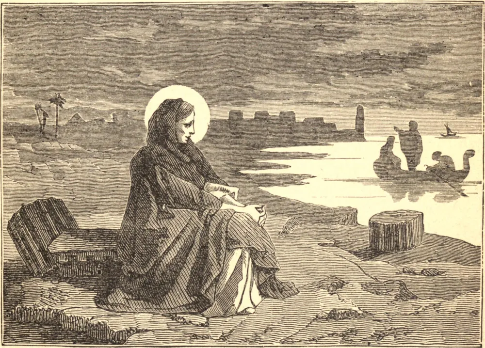

# 4 de maio — SANTA MÔNICA

MÔNICA, mãe de Santo Agostinho, nasceu em 332. Após uma meninice de singular inocência e piedade, foi dada em casamento a Patrício, um pagão. Dedicou-se logo à conversão dele, orando por ele sempre, e conquistando-lhe a reverência e o amor pela santidade de sua vida e por sua afetuosa tolerância. Foi recompensada ao vê-lo batizado um ano antes de sua morte.

Quando seu filho Agostinho se desencaminhou na fé e nos costumes, suas orações e lágrimas foram incessantes. Certa vez insistiu muito com um sábio bispo para que falasse a seu filho, a fim de trazê-lo a melhor disposição, mas ele recusou, desesperando do sucesso com alguém ao mesmo tempo tão capaz e tão obstinado. Contudo, ao testemunhar suas orações e lágrimas, ele lhe disse que tivesse bom ânimo; pois não podia ser que o filho de tantas lágrimas perecesse.

Indo para a Itália, Agostinho pôde por um tempo livrar-se das importunações de sua mãe; mas não pôde escapar de suas orações, que o cercavam como a providência de Deus. Ela o seguiu até a Itália, e ali, por sua maravilhosa conversão, sua tristeza converteu-se em alegria.

Em Óstia, na viagem de regresso, enquanto Agostinho e sua mãe estavam sentados a uma janela conversando sobre a vida dos bem-aventurados, ela voltou-se para ele e disse: "Filho, nada mais há nesta vida que me interesse. O que ainda farei, ou por que estou aqui, não sei. A única razão que eu tinha para desejar demorar-me um pouco mais nesta vida era ver-te cristão católico antes de morrer. Isto Deus me concedeu sobejamente, vendo-te rejeitar a felicidade terrena para tornar-te Seu servo. Que faço eu aqui?" Poucos dias depois teve um acesso de febre, e morreu no ano de 387.

**Reflexão**—É impossível pôr limites ao que a oração perseverante pode fazer. Ela dá ao homem uma participação na Onipotência Divina. A alma de Santo Agostinho jazia presa nas cadeias da heresia e da impureza, ambas tornadas inveteradas por longo hábito. Foram quebradas pelas orações de sua mãe.
