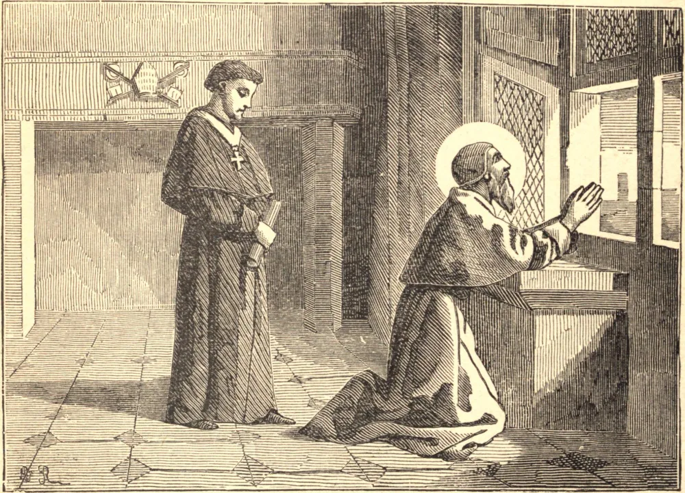

# 5 de maio — SÃO PIO V

FRADE dominicano desde os quinze anos, Miguel Ghislieri, como simples religioso, como inquisidor, como bispo e como cardeal, foi famoso por sua intrépida defesa da fé e da disciplina da Igreja, e pela imaculada pureza de sua própria vida. Seu primeiro cuidado como Papa foi reformar a corte e a capital romanas pelo rigoroso exemplo de sua casa e pelo severo castigo de todos os transgressores. Esforçou-se em seguida por obter das potências católicas o reconhecimento dos decretos tridentinos, dos quais dois fez cumprir com urgência — a residência dos bispos e o estabelecimento dos seminários diocesanos. Revisou o Missal e o Breviário, e reformou a música eclesiástica. Não foi menos ativo em proteger a Igreja por fora. Vemo-lo ao mesmo tempo sustentando o Rei católico da França contra os rebeldes huguenotes, animando Maria, Rainha dos Escoceses, na amargura de seu cativeiro, e excomungando sua rival, a usurpadora Isabel, quando o melhor sangue da Inglaterra havia corrido sobre o cadafalso, e a medida de seus crimes estava cheia. Mas foi em Lepanto que o poder do Santo se mostrou mais manifesto; ali, em outubro de 1571, pela santa liga que havia formado, mas ainda mais por suas orações à grande Mãe de Deus, o idoso Pontífice esmagou as forças otomanas, e salvou a cristandade do turco. Seis meses depois, São Pio morreu, tendo reinado apenas seis anos. São Pio costumava beijar os pés de seu crucifixo ao sair ou entrar em seu quarto. Certo dia os pés afastaram-se de seus lábios. A tristeza encheu-lhe o coração, e fez atos de contrição, temendo ter cometido alguma falta secreta, mas ainda assim não podia beijar os pés. Descobriu-se depois que haviam sido envenenados por um inimigo.

## Reflexão

"Tua cruz, ó Senhor, é a fonte de todas as bênçãos, a causa de todas as graças: por ela os fiéis encontram força na fraqueza, glória na vergonha, vida na morte." — São Leão.
