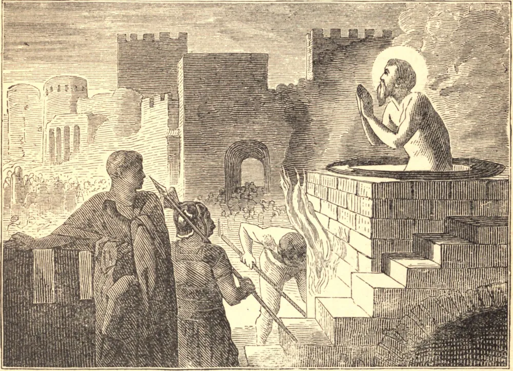

# 6 de maio — SÃO JOÃO ANTE A PORTA LATINA

NO ano de 95, São João, que era o único apóstolo sobrevivente, e governava todas as igrejas da Ásia, foi preso em Éfeso, e enviado prisioneiro a Roma. O Imperador Domiciano não se enterneceu à vista do venerável ancião, mas condenou-o a ser lançado numa caldeira de óleo fervente. O mártir sem dúvida ouviu, com grande alegria, esta bárbara sentença; os mais cruéis tormentos pareciam-lhe leves e mui agradáveis, porque o uniriam, esperava ele, para sempre a seu divino Mestre e Salvador. Mas Deus aceitou sua vontade e coroou seu desejo; conferiu-lhe a honra e o mérito do martírio, mas suspendeu a ação do fogo, como outrora preservara as três crianças de dano na fornalha babilônica. O óleo a ferver mudou-se, em seu favor, num banho revigorante, e o Santo saiu mais refrescado do que quando entrara na caldeira. Domiciano viu este milagre sem dele tirar o menor proveito, mas permaneceu endurecido em sua iniquidade. Contudo, contentou-se depois disto em banir o santo apóstolo para a pequena ilha de Patmos. São João regressou a Éfeso, no reinado de Nerva, que pela brandura, durante seu curto reinado de um ano e quatro meses, trabalhou por restaurar o brilho desbotado do Império Romano. Este glorioso triunfo de São João aconteceu fora da porta de Roma chamada Latina. Uma igreja, que desde então sempre levou este título, foi consagrada no mesmo lugar em memória deste milagre, sob os primeiros imperadores cristãos.

## Reflexão

São João sofreu, acima dos demais Santos, um martírio de amor, sendo mártir, e mais que mártir, ao pé da cruz de seu divino Mestre. Todos os seus sofrimentos foram, por amor e compaixão, impressos em sua alma, e assim por ele partilhados. Ó singular felicidade, ter estado sob a cruz de Cristo! Ó extraordinário privilégio, ter sofrido o martírio na pessoa de Jesus, e ter sido testemunha ocular de tudo o que Ele fez ou padeceu! Se a natureza se revolta dentro de nós contra o sofrimento, recordemos aquelas palavras do divino Mestre: "Não sabes agora por quê; mas o saberás depois."
