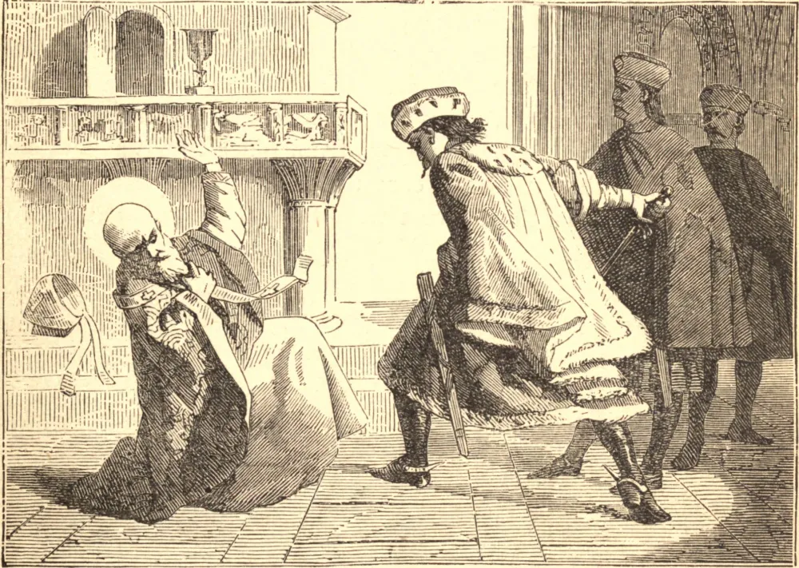

# 7 de maio — SÃO ESTANISLAU, Bispo, Mártir

ESTANISLAU nasceu em resposta a orações, quando seus pais já estavam avançados em idade. Por gratidão, educaram-no para a Igreja, e de santo sacerdote tornou-se com o tempo Bispo de Cracóvia. Boleslau II era então Rei da Polônia — um príncipe de boa índole, mas estragado por um longo curso de vitória e sucesso. Após muitos atos de luxúria e crueldade, ultrajou o reino inteiro ao raptar a esposa de um de seus nobres. Contra este escândalo público somente o casto e brando bispo ergueu a voz. Tendo encomendado o assunto a Deus, desceu ao palácio e abertamente repreendeu o rei por seu crime contra Deus e contra seus súditos, e ameaçou excomungá-lo se persistisse em seu pecado. Para caluniar o caráter do Santo, Boleslau subornou os sobrinhos de um certo Paulo, recentemente falecido, para que jurassem que seu tio jamais fora pago por uma terra comprada pelo bispo para a Igreja. O Santo apresentou-se sem temor diante do tribunal do rei, embora todas as suas testemunhas o abandonassem, e garantiu trazer o morto para testemunhar a seu favor dentro de três dias. No terceiro dia, após muitas orações e lágrimas, ressuscitou Paulo, e conduziu-o em suas vestes fúnebres diante do rei. Boleslau fingiu por algum tempo uma vida melhor. Logo, porém, recaiu nos mais escandalosos excessos, e o bispo, achando inútil toda admoestação, pronunciou a sentença de excomunhão. Em desafio à censura, a 8 de maio de 1079, o rei desceu a uma capela onde o próprio bispo celebrava a Missa, e mandou entrar três grupos de soldados para o matarem ao altar. Cada um por sua vez saiu, dizendo que fora espantado por uma luz do céu. Então o rei precipitou-se para dentro e matou o Santo ao altar com sua própria mão.

## Reflexão

A mais segura correção do vício é uma vida irrepreensível. Contudo, há ocasiões em que o silêncio nos tornaria responsáveis pelos pecados dos outros. Em tais ocasiões, repreendamos, em nome de Deus, o transgressor sem temor.
