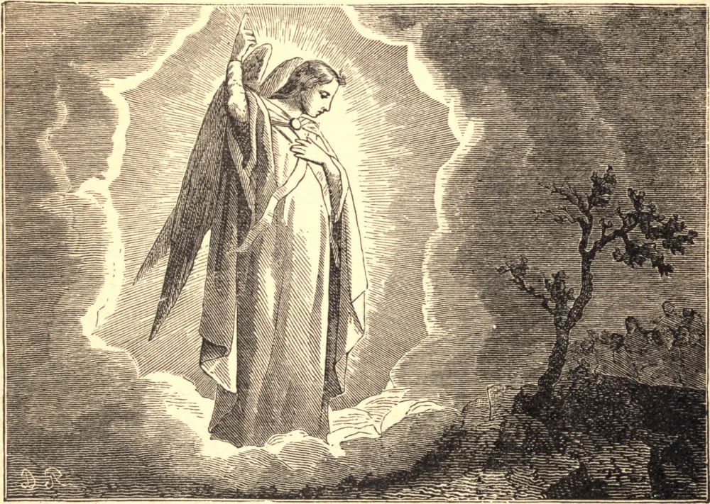

# 8 de maio — A APARIÇÃO DE SÃO MIGUEL ARCANJO

É MANIFESTO, pelas Sagradas Escrituras, que Deus se compraz em fazer frequente uso do ministério dos espíritos celestes nas disposições de Sua providência neste mundo, e especialmente para com o homem. Daí o nome de Anjo (que não é propriamente uma denominação de natureza, mas de ofício) ter-lhes sido atribuído. Os anjos são todos espíritos puros; são, por uma propriedade de sua natureza, imortais, como todo espírito o é. Têm o poder de mover-se ou transportar-se de um lugar a outro, e tal é sua atividade que não nos é fácil concebê-la. Entre os santos arcanjos, distinguem-se particularmente na Sagrada Escritura São Miguel, São Gabriel e São Rafael. São Miguel, a quem a Igreja honra neste dia, foi o príncipe dos anjos fiéis que se opuseram a Lúcifer e a seus associados em sua revolta contra Deus. Como o demônio é o inimigo jurado da santa Igreja de Deus, São Miguel é seu protetor especial contra os seus assaltos e estratagemas. Este santo arcanjo sempre foi honrado na Igreja cristã como seu guardião sob Deus, e como o protetor dos fiéis; pois Deus se compraz em empregar o zelo e a caridade dos bons anjos e de seu chefe contra a malícia do demônio. Para agradecer à Sua adorável bondade por este benefício de Sua misericordiosa providência é que foi instituída pela Igreja esta festa em honra dos bons anjos, devoção na qual ela foi animada por várias aparições deste glorioso arcanjo. Entre outras, registra-se que São Miguel, numa visão, admoestou o Bispo de Siponto a edificar uma igreja em sua honra no Monte Gargano, perto de Manfredonia, no reino de Nápoles. Quando o Imperador Otão III, contra a sua palavra, mandou matar, por rebelião, Crescêncio, um senador romano, tocado de remorso lançou-se aos pés de São Romualdo, que, em satisfação por seu crime, lhe impôs caminhar descalço, numa peregrinação penitencial, até a igreja de São Miguel no Monte Gargano, penitência que ele cumpriu em 1002. Menciona-se em particular deste especial guardião e protetor da Igreja que, na perseguição do Anticristo, ele se levantará poderosamente em sua defesa: "Naquele tempo se levantará Miguel, o grande príncipe, que está em defesa dos filhos do teu povo."

## Reflexão

São Miguel não é apenas o protetor da Igreja, mas de toda alma fiel. Ele venceu o demônio pela humildade: nós estamos alistados na mesma guerra. Suas armas eram a humildade e o ardente amor de Deus: as mesmas devem ser as nossas armas. Devemos considerar este arcanjo como nosso chefe sob Deus; e, resistindo corajosamente ao demônio em todos os seus assaltos, clamar: Quem se pode comparar a Deus?
