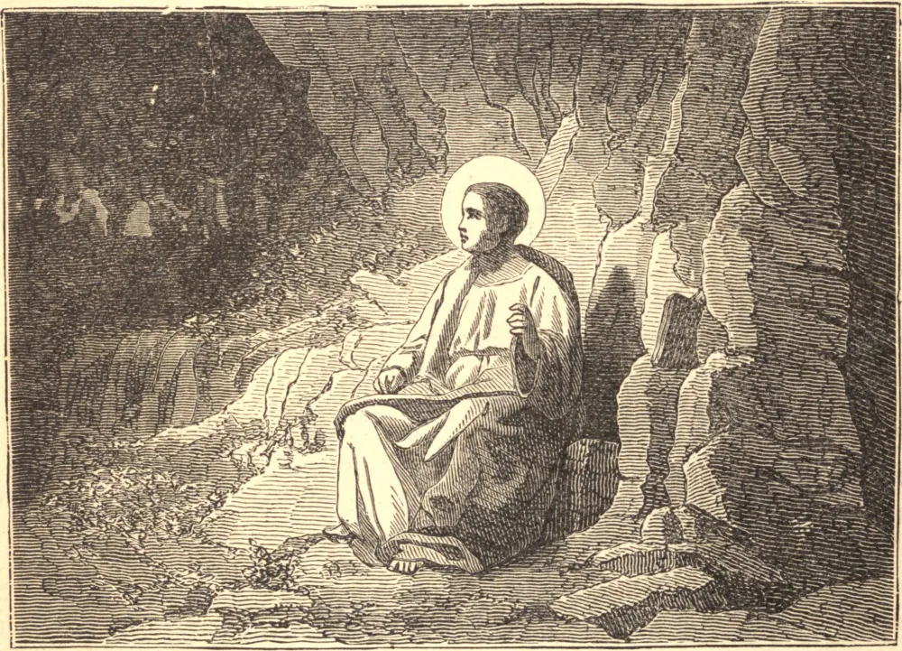

# 9 de maio — SÃO GREGÓRIO NAZIANZENO

GREGÓRIO nasceu de pais santos, e foi o amigo escolhido de São Basílio. Estudaram juntos em Atenas, afastaram-se ao mesmo tempo das mais belas perspectivas mundanas, e por alguns anos viveram juntos em reclusão, autodisciplina e labor. Gregório foi elevado, quase à força, ao sacerdócio; e com o tempo foi feito Bispo de Nazianzo por São Basílio, que se tornara Arcebispo de Cesareia. Quando tinha cinquenta anos de idade, foi escolhido, por seus raros dotes e sua disposição conciliadora, para ser Patriarca de Constantinopla, então perturbada e devastada pelos arianos e outros hereges. Naquela cidade ele laborou com maravilhoso sucesso. Os arianos ficaram de tal modo irritados com o declínio de sua heresia que perseguiram o Santo com ultraje, calúnia e violência, e por fim resolveram tirar-lhe a vida. Para este fim escolheram um jovem resoluto, que prontamente assumiu a sacrílega incumbência. Mas Deus não lhe permitiu levá-la a cabo. Ele foi tocado de remorso, e lançou-se aos pés do Santo, confessando seu intento pecaminoso. São Gregório imediatamente o perdoou, tratou-o com toda bondade, e recebeu-o entre os seus amigos, para o assombro e edificação de toda a cidade, e para a confusão dos hereges, cujo crime servira apenas de realce à virtude do Santo. São Jerônimo gloria-se de ter-se sentado a seus pés, e chama-o seu mestre e seu catequista na Sagrada Escritura. Mas sua humildade, suas austeridades, a insignificância de sua pessoa, e acima de tudo o seu próprio sucesso, atraíram sobre ele o ódio dos inimigos da Fé. Foi perseguido pelos magistrados, apedrejado pela plebe, e contrariado e abandonado até por seus irmãos bispos. Durante o segundo Concílio Geral renunciou à sua sé, esperando assim restaurar a paz à cidade atormentada, e retirou-se para a sua cidade natal, onde morreu em 390. Foi um gracioso poeta, um pregador a um tempo eloquente e sólido; e como campeão da Fé tão bem equipado, tão esforçado e tão exato, que é chamado São Gregório o Teólogo.

## Reflexão

"Devemos vencer nossos inimigos", disse São Gregório, "pela brandura; conquistá-los pela tolerância. Sejam eles punidos por sua própria consciência, não por nossa ira. Não murchemos de imediato a figueira, da qual um jardineiro mais hábil ainda poderá obter fruto."
