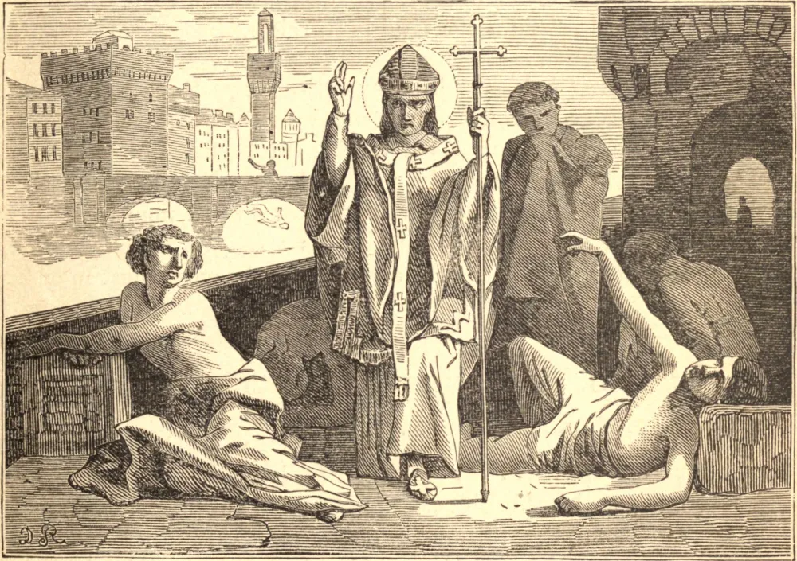

# 10 de maio — SANTO ANTONINO, Bispo

ANTONINO, ou Pequeno Antônio, como era chamado por sua pequena estatura, nasceu em Florença em 1389. Após uma infância de singular santidade, suplicou ser admitido na casa dominicana de Fiesole; mas o Superior, para provar sua sinceridade e perseverança, disse-lhe que primeiro deveria aprender de cor o livro das Decretais, contendo várias centenas de páginas. Esta tarefa aparentemente impossível foi cumprida em doze meses; e Antonino recebeu o cobiçado hábito aos dezesseis anos. Ainda muito jovem, ocupou vários postos importantes de sua Ordem, e era consultado em questões de dificuldade pelos homens mais doutos de seu tempo; sendo conhecido, por sua maravilhosa prudência, como "o Conselheiro". Escreveu várias obras de teologia e história, e participou como Teólogo Papal do Concílio de Florença. Em 1446 foi compelido a aceitar o arcebispado daquela cidade; e nesta dignidade granjeou para si o título de "o Pai dos Pobres", pois tudo o que tinha estava à disposição deles. Santo Antonino nunca recusava uma esmola que lhe fosse pedida em nome de Deus. Quando não tinha dinheiro, dava suas roupas, sapatos ou móveis. Um dia, sendo enviado pelos florentinos ao Papa, ao aproximar-se de Roma um mendigo veio até ele quase nu, e pediu-lhe uma esmola pelo amor de Cristo. Superando São Martinho, Antonino deu-lhe toda a sua capa. Quando entrou na cidade, outra lhe foi dada; por quem, não soube. Sua casa compunha-se de apenas seis pessoas; seu palácio não continha baixela nem móveis custosos, e estava muitas vezes quase desprovido do necessário à vida. Sua única mula era frequentemente vendida para o alívio dos pobres, sendo depois recomprada para ele por algum cidadão abastado. Morreu abraçando o crucifixo, a 2 de maio de 1459, repetindo com frequência as palavras: "Servir a Deus é reinar."

## Reflexão

"As obras de esmola", diz Santo Agostinho, "compreendem toda espécie de serviço prestado ao nosso próximo que de tal auxílio necessita. Quem ampara um coxo dá-lhe uma esmola com os pés; quem guia um cego faz-lhe uma caridade com os olhos; quem carrega um inválido ou um ancião sobre os ombros transmite-lhe uma esmola de sua força. Por isso ninguém é tão pobre que não possa dar uma esmola ao homem mais rico do mundo."
