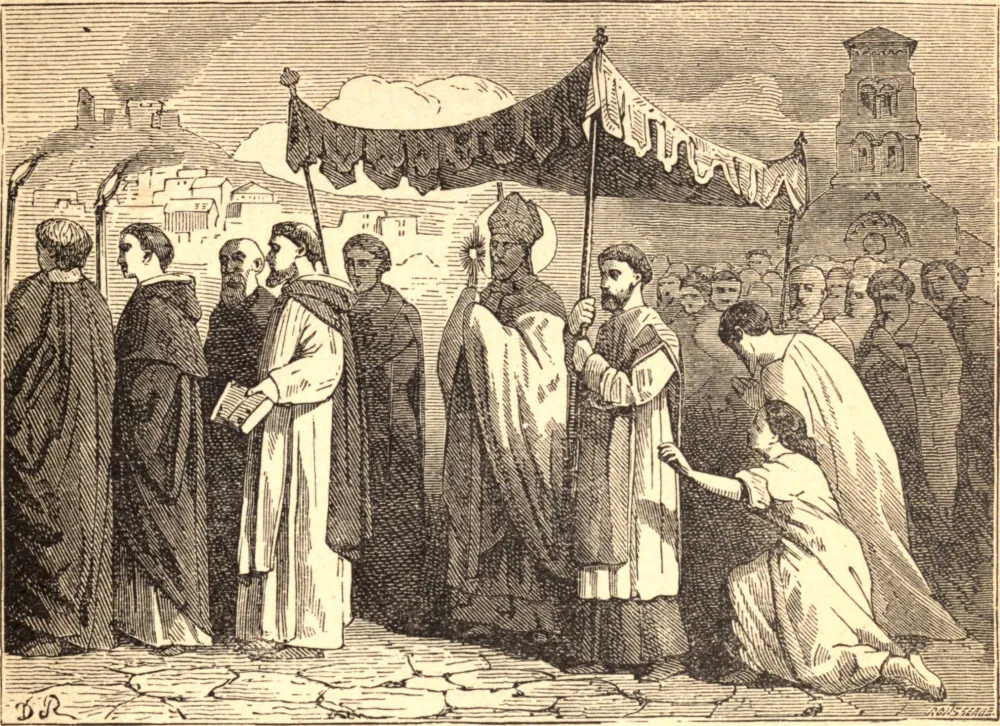

# 11 de maio — SÃO MAMERTO, Arcebispo

SÃO MAMERTO, Arcebispo de Vienne no Delfinado, foi um prelado renomado por sua santidade, saber e milagres. Instituiu em sua diocese os jejuns e súplicas chamados Rogações, nas seguintes ocasiões. Deus Todo-Poderoso, para punir os pecados do povo, visitou-o com guerras e outras calamidades públicas, e despertou-o de sua letargia espiritual pelos terrores de terremotos, incêndios e feras vorazes, as quais por vezes eram vistas na própria praça pública das cidades. Estes males os ímpios atribuíam ao cego acaso; mas as pessoas religiosas e prudentes consideravam-nos sinais da ira divina, que ameaçava sua inteira destruição.

Em meio a estes flagelos, São Mamerto recebeu um sinal da misericórdia divina. Um terrível incêndio sobreveio na cidade de Vienne, que frustrou os esforços dos homens; mas pelas orações do bom bispo o fogo subitamente se apagou. Este milagre comoveu fortemente o espírito do povo.

O santo prelado aproveitou esta ocasião para torná-lo sensível à necessidade e eficácia da oração devota, e formou o piedoso desígnio de instituir um jejum e uma súplica anuais de três dias, em que todos os fiéis se uniriam, com sincera compunção do coração, para aplacar a indignação divina pelo jejum, a oração, as lágrimas e a confissão dos pecados. A Igreja de Auvergne, da qual São Sidônio era bispo, adotou esta piedosa instituição antes do ano 475, e ela se tornou em muito breve tempo uma prática universal. São Mamerto morreu por volta do ano 477.

**Reflexão**—"Sabei que o Senhor ouvirá vossas orações, se perseverardes constantes em jejuns e orações na presença do Senhor" (Judite iv. 11).
