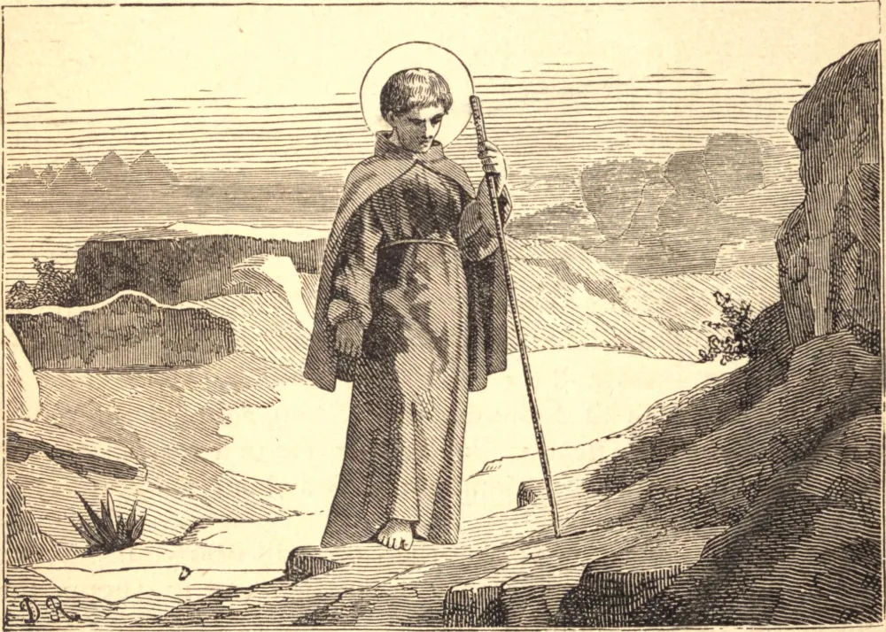

# 12 de maio — SANTO EPIFÂNIO, Arcebispo

SANTO EPIFÂNIO nasceu por volta do ano 310, na Palestina. Em sua juventude começou o estudo das Sagradas Escrituras, abraçou a vida monástica, e foi ao Egito para aperfeiçoar-se nos exercícios daquele estado, nos desertos daquele país. Voltou à Palestina por volta do ano 333, e construiu um mosteiro perto do lugar de seu nascimento. Seus labores no exercício da virtude pareciam a alguns superar suas forças; mas sua apologia era sempre: "Deus não dá o reino dos céus senão com a condição de que trabalhemos; e tudo o que podemos fazer não guarda proporção com tal coroa." Às suas austeridades corporais acrescentava uma infatigável aplicação à oração e ao estudo. A maioria dos livros então em voga passou por suas mãos; e aperfeiçoou-se muito no saber por suas viagens a muitas partes.

Embora hábil diretor de muitos outros, Santo Epifânio tomou o grande Santo Hilário como seu mestre na vida espiritual, e gozou da felicidade de sua direção e íntima convivência do ano 333 a 356.

A reputação de sua virtude tornou Santo Epifânio conhecido em países distantes, e por volta do ano 367 foi escolhido Bispo de Salamina em Chipre. Mas continuou a usar o hábito monástico, e prosseguiu governando seu mosteiro na Palestina, que visitava de tempos em tempos. Por vezes relaxava suas austeridades em favor da hospitalidade, preferindo a caridade à abstinência. Ninguém o superava em ternura e caridade para com os pobres. A veneração que todos os homens tinham por sua santidade isentou-o da perseguição do imperador ariano Valente. Em 376 empreendeu uma viagem a Antioquia na esperança de converter Vital, o bispo apolinarista; e em 382 acompanhou São Paulino daquela cidade a Roma, onde se hospedaram na casa de Santa Paula; nosso Santo em retribuição a acolheu depois dez dias em Chipre, em 385. O próprio nome de um erro na fé, ou a sombra do perigo do mal, atemorizava-o, e o Santo incorreu em alguns enganos em certas ocasiões, que procediam do zelo e da simplicidade. Estava de regresso a Salamina, após uma breve ausência, quando morreu em 403, tendo sido bispo trinta e seis anos.

**Reflexão**—"Nisto está a caridade: não como se tivéssemos nós amado a Deus, mas porque Ele primeiro nos amou."
