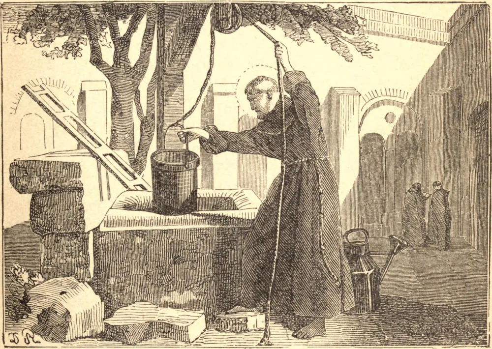

# 13 de maio — SÃO JOÃO, O SILENCIOSO

JOÃO nasceu de uma nobre família em Nicópolis, na Armênia, no ano 454; mas derivou da virtude de seus pais uma nobreza muito mais ilustre do que a de sua linhagem. Após a morte deles, edificou em Nicópolis uma igreja em honra da Santíssima Virgem, bem como um mosteiro, no qual, com dez fervorosos companheiros, encerrou-se quando tinha apenas dezoito anos de idade, com o propósito de fazer da salvação e da mais perfeita santificação de sua alma a sua única e fervorosa busca. Não somente para evitar o perigo do pecado pela língua, mas também por sincera humildade e desprezo de si mesmo, e pelo amor do recolhimento interior e da oração, ele muito raramente falava; e quando obrigado a fazê-lo, era sempre em pouquíssimas palavras, e com grande discrição. Para sua extrema aflição, quando tinha apenas vinte e oito anos de idade, o Arcebispo de Sebaste obrigou-o a deixar seu retiro, e ordenou-o Bispo de Colônia na Armênia, em 482. Nesta dignidade João conservou sempre o mesmo espírito, e, na medida em que era compatível com os deveres de seu encargo, continuou suas austeridades e exercícios monásticos. Enquanto velava certa noite em oração, viu diante de si uma brilhante cruz formada no ar, e ouviu uma voz que lhe dizia: "Se desejas ser salvo, segue esta luz." Pareceu-lhe mover-se diante dele, e por fim apontar para o mosteiro de São Sabas. Estando certo de qual era o sacrifício que Deus exigia de suas mãos, encontrou meios de abdicar do encargo episcopal, e retirou-se para o vizinho mosteiro de São Sabas, que naquele tempo contava cento e cinquenta fervorosos monges. São João tinha então trinta e oito anos. Após viver ali desconhecido por alguns anos, buscando água, carregando pedras, e fazendo outros trabalhos servis, São Sabas, julgando-o digno de ser promovido ao sacerdócio, apresentou-o ao Patriarca Elias. São João tomou o patriarca à parte, e, tendo obtido dele uma promessa de segredo, disse: "Padre, fui ordenado bispo; mas por causa da multidão de meus pecados fugi, e vim a este deserto aguardar a visita do Senhor." O patriarca ficou perplexo, mas Deus revelou a São Sabas o estado do assunto, e então, chamando João, queixou-se-lhe de sua descortesia em ocultar-lhe a coisa. Vendo-se descoberto, João quis deixar o mosteiro, nem pôde São Sabas persuadi-lo a ficar, senão com a promessa de jamais divulgar o segredo. No ano 503, São João retirou-se para um ermo vizinho, mas em 510 voltou ao mosteiro, e confinou-se por quarenta anos em sua cela. São João, por seu exemplo e conselhos, conduziu muitas almas fervorosas a Deus, e continuou a emular, tanto quanto este estado mortal o permite, a gloriosa ocupação dos espíritos celestes em um ininterrupto exercício de amor e louvor, até passar para a sua bem-aventurada companhia, pouco depois do ano 558; tendo vivido setenta e seis anos no deserto, o qual fora interrompido apenas pelos nove anos de sua dignidade episcopal.

## Reflexão

O amor do silêncio cristão é prova de que uma alma faz da ocupação com Deus a sua maior delícia, e não encontra consolo igual ao de conversar com Ele. Este é o paraíso de todas as almas devotas.
