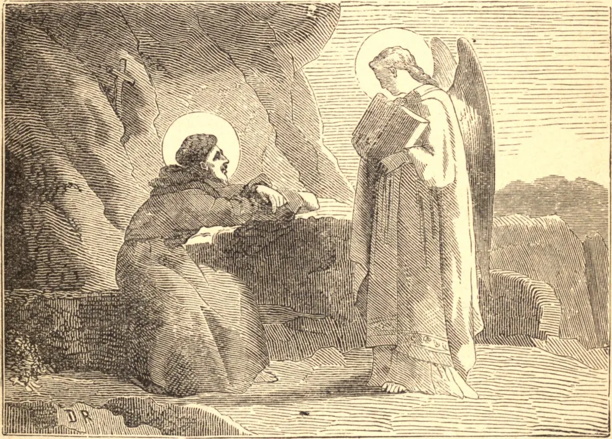

# 14 de maio — SÃO PACÔMIO, Abade

NO início do quarto século fizeram-se por todo o Egito grandes recrutamentos de tropas para o serviço do imperador romano. Entre os recrutas estava Pacômio, um jovem pagão, então em seu vigésimo primeiro ano. Em sua descida pelo Nilo passou por uma aldeia, cujos habitantes lhe deram alimento e dinheiro. Maravilhando-se com esta bondade, Pacômio foi informado de que eram cristãos, e esperavam uma recompensa na vida vindoura. Então rogou a Deus que lhe mostrasse a verdade, e prometeu consagrar sua vida ao Seu serviço. Ao ser dispensado, voltou a uma aldeia cristã do Egito, onde foi instruído e batizado. Em vez de ir para casa, procurou Palêmon, um idoso solitário, para dele aprender uma vida perfeita, e com grande alegria abraçou as mais severas austeridades. Seu alimento era pão e água, uma vez por dia no verão, e uma vez a cada dois dias no inverno; por vezes acrescentavam ervas, mas misturavam-lhes cinzas. Dormiam apenas uma hora cada noite, e este breve repouso Pacômio tomava sentado, ereto e sem apoio. Três vezes Deus lhe revelou que ele devia fundar uma ordem religiosa em Tabena; e um anjo deu-lhe uma regra de vida. Confiando em Deus, edificou um mosteiro, ainda que não tivesse discípulos; mas vastas multidões logo a ele afluíram, e ele as formou em perfeito desapego das criaturas e de si mesmas. Um dia um monge, à custa de grandes esforços, conseguiu fazer duas esteiras em vez da única que era a tarefa diária habitual, e dispôs ambas diante de sua cela, para que Pacômio pudesse ver quão diligente fora. Mas o Santo, percebendo a vanglória que havia inspirado o ato, disse: "Este irmão tomou-se de muito trabalho de manhã à noite para dar sua obra ao demônio." Então, para curá-lo de seu engano, Pacômio impôs-lhe como penitência guardar sua cela por cinco meses e não provar outro alimento senão pão e água. Suas visões e milagres foram inumeráveis, e ele lia todos os corações. Sua santa morte ocorreu em 348.

## Reflexão

"Viver em grande simplicidade", disse São Pacômio, "e numa sábia ignorância, é sumamente sábio."
