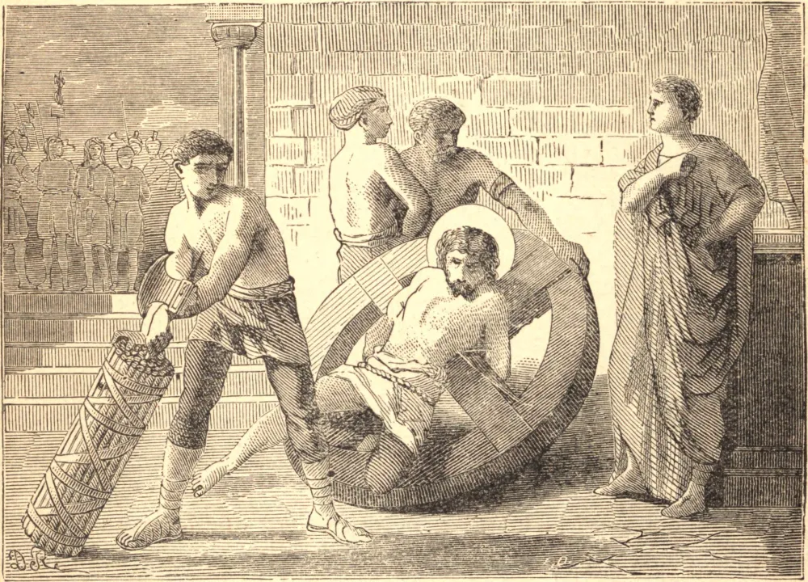

# 15 de maio — SÃO PEDRO e SANTA DIONÍSIA

NA perseguição de Décio o sangue dos cristãos correu em Lâmpsaco, uma cidade da Ásia Menor. São Pedro foi o primeiro a ser conduzido perante o procônsul e condenado a morrer pelo nome de Cristo. Embora jovem, foi alegremente para seus tormentos. Foi atado a uma roda por cadeias de ferro, e seus ossos foram quebrados, mas ele ergueu os olhos ao céu com semblante sorridente e disse: "Eu Te dou graças, ó Senhor Jesus Cristo, porque me deste paciência, e me fizeste vitorioso sobre o tirano." O procônsul viu de quão pouco valia o sofrimento, e ordenou que o mártir fosse decapitado.

Mas um pouco depois, na mesma cidade, a virgem Dionísia mostrou igual ânsia de sofrer. Santa Dionísia ganhou a coroa que um apóstata perdeu, e a história dele pode ensinar-nos que aqueles que perdem a Cristo em vez de sofrer com Ele perdem tudo. Com a força que lhe restava ele clamou: "Eu nunca fui cristão. Sacrifico aos deuses." Por isso foi descido, e ofereceu sacrifício. Mas foi possuído pelo demônio, a quem havia escolhido por seu senhor. Caiu por terra num acesso, mordeu a própria língua, e assim expirou. Escapou de uma pequena dor, e em vez disso foi para os tormentos sem fim do inferno, e perdeu o eterno descanso.

"Ó homem miserável!", clamou Dionísia, "por que temeste um pouco de sofrimento e escolheste a dor eterna em seu lugar?" Foi presa e levada a horrível ultraje, mas seu anjo da guarda apareceu ao seu lado e protegeu a esposa de Cristo. Escapando da prisão, ela ainda ardia com o desejo de ser desfeita e estar com Cristo. Lançou-se sobre os corpos dos mártires, dizendo: "De bom grado morreria convosco na terra, para que pudesse viver convosco no céu." E Cristo, que é a coroa das virgens e a força dos mártires, concedeu-lhe o desejo de seu coração.

**Reflexão**—Os mártires eram em tudo como nós, com naturezas que recuavam diante do sofrimento. Eram pacientes sob ele porque olhavam para a recompensa eterna, e suportavam como vendo Aquele que é invisível.
