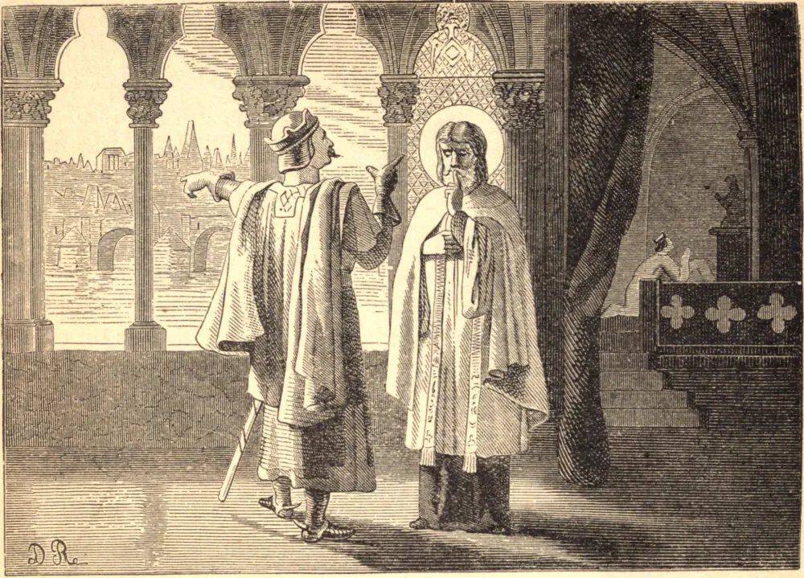

# 16 de maio — SÃO JOÃO NEPOMUCENO

SÃO JOÃO nasceu, em resposta à oração, em 1330, de pais pobres, em Nepomuk, na Boêmia. Em gratidão eles o consagraram a Deus; e sua santa vida como sacerdote levou à sua nomeação como capelão da corte do Imperador Venceslau, onde converteu numerosas pessoas por sua pregação e exemplo.

Entre aqueles que buscavam seu conselho estava a imperatriz, que muito sofria com o ciúme infundado de seu marido. São João ensinou-a a carregar sua cruz com alegria; mas sua piedade apenas irritou o imperador, e ele tentou extorquir do Santo as confissões dela. Lançou São João num calabouço, mas nada obteve; depois, convidando-o ao seu palácio, prometeu-lhe riquezas se cedesse, e ameaçou-o de morte se recusasse. O Santo permaneceu em silêncio. Foi torturado no potro e queimado com tochas; mas nenhuma palavra, salvo Jesus e Maria, lhe caiu dos lábios. Por fim posto em liberdade, passou seu tempo pregando, e preparando-se para a morte que sabia estar próxima.

Na Vigília da Ascensão, 16 de maio, Venceslau, após uma derradeira e infrutífera tentativa de abalar sua constância, ordenou que ele fosse lançado ao rio, e naquela noite as mãos e os pés do mártir foram atados, e ele foi atirado da ponte de Praga. Quando morria, uma luz celeste brilhando sobre as águas revelou o corpo, que foi sepultado com as honras devidas a um Santo. Poucos anos depois, Venceslau foi deposto por seus próprios súditos, e morreu uma morte impenitente e miserável.

Em 1618 os soldados calvinistas e hussitas do Eleitor protestante Frederico tentaram repetidamente demolir o santuário de São João em Praga. Cada tentativa foi miraculosamente frustrada; e uma vez as pessoas envolvidas no sacrilégio, entre as quais havia um inglês, foram mortas no mesmo lugar. Em 1620 as tropas imperiais reconquistaram a cidade por uma vitória que foi atribuída à intercessão do Santo, pois ele foi visto na véspera da batalha, radiante de glória, guardando a catedral. Quando seu santuário foi aberto, trezentos e trinta anos após seu falecimento, a carne havia desaparecido, e apenas um membro permanecera incorrupto, a língua; assim ainda, em silêncio, dando glória a Deus.

**Reflexão**—São João, que por seu invencível silêncio sacramental ganhou sua coroa, ensina-nos a preferir a tortura e a morte a ofender o Criador com nossa língua. Quantas vezes por dia perdemos graça e força por pecados da palavra!
