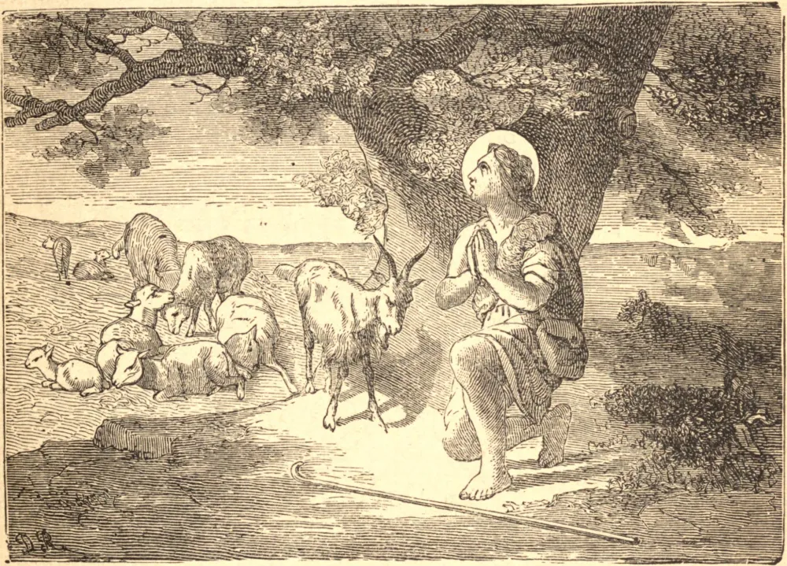

# 17 de maio — SÃO PASCOAL BAYLON

DESDE criança Pascoal parece ter sido assinalado para o serviço de Deus; e em meio aos seus labores diários encontrava tempo para instruir e evangelizar os rudes pastores que apascentavam seus rebanhos nas colinas de Aragão. Aos vinte e quatro anos de idade entrou na Ordem Franciscana, na qual, todavia, permaneceu, por humildade, um simples irmão leigo, e ocupava-se, de preferência, com as tarefas mais ásperas e servis. Distinguia-se por um ardente amor e devoção ao Santíssimo Sacramento. Passava horas de joelhos diante do tabernáculo — frequentemente era elevado do chão no fervor de sua oração — e ali, da própria e eterna Verdade, hauria tais tesouros de sabedoria que, por mais iletrado que fosse, era tido por todos como um mestre em teologia e ciência espiritual. Pouco depois de sua profissão foi chamado a Paris para um assunto relacionado à sua Ordem. A viagem estava cheia de perigos, devido à hostilidade dos huguenotes, que eram numerosos naquele tempo no sul da França; e em quatro ocasiões distintas Pascoal esteve em iminente perigo de morte às mãos dos hereges. Mas não era da vontade de Deus que Seu servo obtivesse a coroa do martírio que, embora julgando-se de todo indigno dela, ele tão ardentemente desejava, e ele voltou a salvo ao seu convento, onde morreu em odor de santidade, a 15 de maio de 1592.

Enquanto Pascoal velava suas ovelhas na encosta da montanha, ouviu o sino da consagração soar de uma igreja no vale abaixo, onde os aldeões se haviam reunido para a Missa. O Santo caiu de joelhos, quando subitamente apareceu diante dele um anjo de Deus, trazendo em suas mãos a Sagrada Hóstia, e oferecendo-a à sua adoração. Aprende disto quão agradáveis a Jesus Cristo são aqueles que O honram neste grande mistério de Seu amor; e como a eles especialmente se cumpre esta promessa: "Não vos deixarei órfãos: virei a vós" (João xiv. 18).

## Reflexão

São Pascoal ensina-nos a nunca deixar passar um dia sem visitar Jesus na estreita morada onde Ele, a quem o próprio céu não pode conter, permanece dia e noite por amor de nós.
