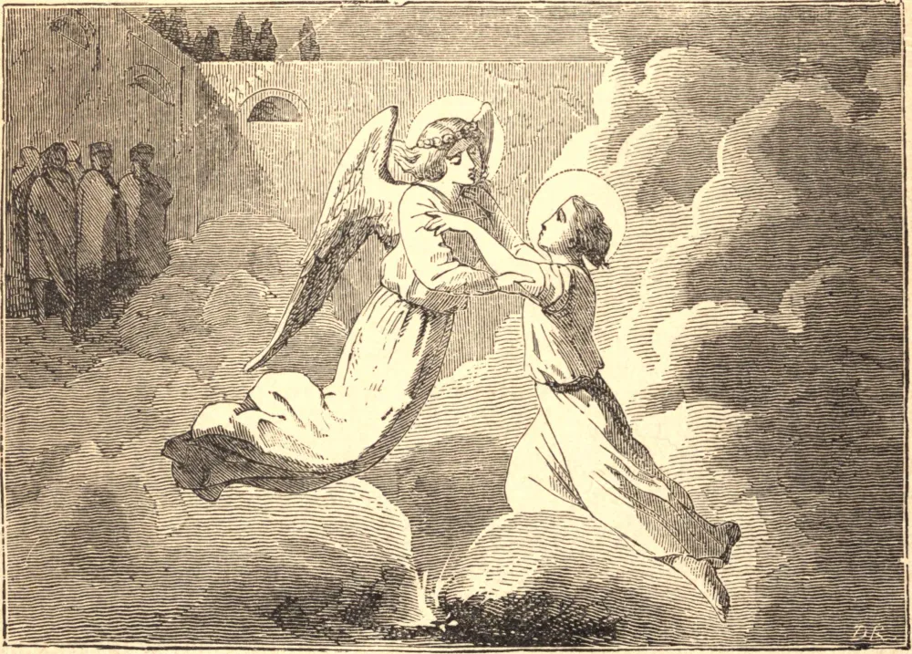

# 18 de maio — SÃO VENÂNCIO, Mártir

SÃO VENÂNCIO nasceu em Camerino, na Itália, e aos quinze anos de idade foi preso como cristão e levado perante um juiz. Como se achou impossível abalar sua constância, fosse por ameaças ou promessas, foi condenado a ser açoitado, mas foi miraculosamente salvo por um anjo. Foi então queimado com tochas e suspenso sobre um fogo baixo, para que fosse sufocado pela fumaça. O secretário do juiz, admirando a firmeza do Santo, e vendo um anjo vestido de branco, que pisava o fogo e novamente libertava o jovem mártir, proclamou sua fé em Cristo, foi batizado com toda a sua família, e pouco depois ganhou ele mesmo a coroa do martírio. Venâncio foi então levado perante o governador, que, incapaz de fazê-lo renegar sua fé, lançou-o na prisão com um apóstata, que em vão se esforçou por tentá-lo. O governador então ordenou que lhe quebrassem os dentes e as mandíbulas, e mandou lançá-lo num forno, do qual o anjo mais uma vez o livrou. O Santo foi novamente conduzido perante o juiz, que à vista dele caiu de cabeça de seu assento e expirou, clamando: "O Deus de Venâncio é o verdadeiro Deus; destruamos nossos ídolos." Sendo esta circunstância contada ao governador, ele ordenou que Venâncio fosse atirado aos leões; mas estas feras, esquecendo sua ferocidade natural, agacharam-se aos pés do Santo. Então, por ordem do tirano, o jovem mártir foi arrastado por um monte de sarças e espinhos, mas novamente Deus manifestou a glória de Seu servo; sofrendo os soldados de sede, o Santo ajoelhou-se sobre uma rocha e a assinalou com uma cruz, quando imediatamente um jato de água clara e fresca jorrou do lugar. Este milagre converteu muitos dos que o presenciaram, e então o governador mandou decapitar Venâncio e seus convertidos juntos no ano 250. Os corpos destes mártires são conservados na igreja de Camerino que leva o nome do Santo.

## Reflexão

O amor do sofrimento marca o grau mais perfeito no amor de Deus. O próprio Nosso Senhor era consumido pelo desejo de sofrer, porque ardia com o amor de Deus. Devemos começar pela paciência e pelo desapego. Por fim aprenderemos a amar os sofrimentos que nos conformam à Paixão de nosso Redentor.
