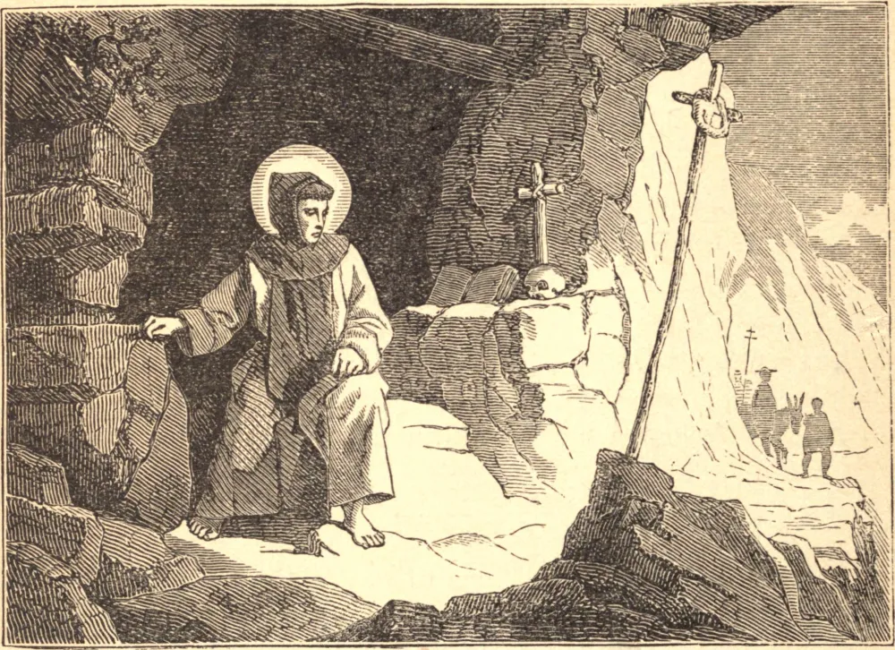

# 19 de maio — SÃO PEDRO CELESTINO

QUANDO criança, Pedro tinha visões de Nossa Senhora, e dos anjos e santos. Eles o animavam em sua oração, e o repreendiam quando caía em alguma falta. Sua mãe, embora apenas uma pobre viúva, pô-lo na escola, certa de que ele um dia seria um Santo.

Aos vinte anos de idade, deixou seu lar na Apúlia para viver numa solidão montanhosa. Ali passou três anos, assaltado pelos espíritos malignos e cercado de tentações da carne, mas consolado pelas visitas dos anjos. Depois disto sua reclusão foi invadida por discípulos, que se recusavam a ser dispensados; e a regra de vida que lhes deu formou o fundamento da Ordem Celestina. Os anjos auxiliaram na igreja que Pedro construiu; sinos invisíveis tocavam repiques de incomparável doçura, e uma música celeste enchia o santuário quando ele oferecia o Santo Sacrifício.

Subitamente viu-se arrancado de sua amada solidão por sua eleição ao trono Papal. A resistência de nada valeu. Tomou o nome de Celestino, para lembrá-lo do céu que estava deixando e pelo qual suspirava, e foi consagrado em Aquila. Após um reinado de quatro meses, Pedro convocou os cardeais à sua presença, e solenemente renunciou ao seu encargo.

São Pedro construiu para si uma cela de tábuas em seu palácio, e ali continuou sua vida de eremita; e quando, para que sua simplicidade não fosse aproveitada para perturbar a paz da Igreja, foi posto sob guarda, ele disse: "Eu não desejava senão uma cela, e uma cela me deram." Ali gozou de sua antiga e amorosa intimidade com os santos e os anjos, e cantou os louvores divinos quase continuamente. Por fim, no Domingo de Pentecostes, disse aos seus guardas que morreria dentro de uma semana, e imediatamente adoeceu. Recebeu os últimos sacramentos; e no sábado seguinte, ao terminar o verso final de Laudes, "Que todo espírito louve ao Senhor!", fechou os olhos para este mundo e os abriu para a visão de Deus.

**Reflexão**—"Aquele que", diz a *Imitação de Cristo*, "se afasta dos conhecidos e amigos, dele se aproximará Deus com Seus santos anjos."
