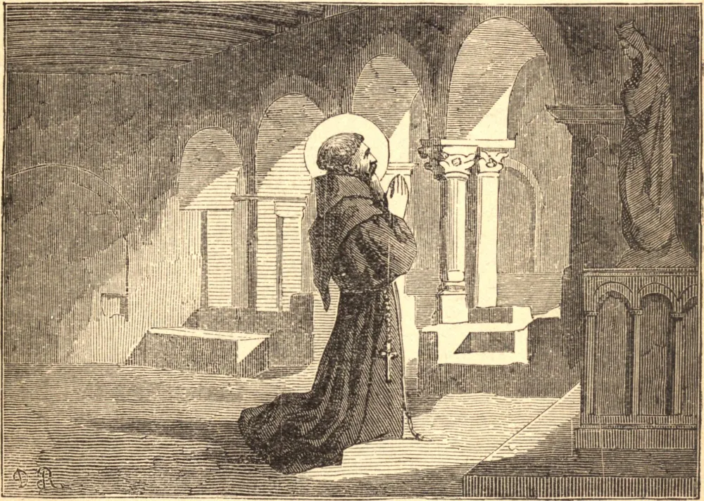

# 20 de maio — SÃO BERNARDINO DE SIENA

EM 1408, São Vicente Ferrer certa vez interrompeu subitamente seu sermão para declarar que havia entre seus ouvintes um jovem franciscano que um dia seria pregador maior do que ele próprio, e que seria posto diante dele em honra pela Igreja. Este frade desconhecido era Bernardino. De nobre nascimento, passara sua juventude em obras de misericórdia, e em seguida entrara na vida religiosa. Em razão de um defeito na fala, seu êxito como pregador a princípio parecia duvidoso, mas, pelas orações de Nossa Senhora, este obstáculo foi miraculosamente removido, e Bernardino deu início a um apostolado que durou trinta e oito anos. Por suas palavras ardentes e pelo poder do Santíssimo Nome de Jesus, que exibia numa tabuleta ao fim de seus sermões, obteve conversões miraculosas e reformou a maior parte da Itália.

Mas este êxito havia de ser exaltado pela cruz. O Santo foi denunciado como herege e sua devoção como idolátrica. Após muitas provações, viveu para ver sua inocência comprovada, e um memorial duradouro de sua obra estabelecido numa igreja. A Festa do Santíssimo Nome comemora ao mesmo tempo seus sofrimentos e seu triunfo. Faleceu na véspera da Ascensão, em 1444, enquanto seus irmãos cantavam a antífona: "Pai, manifestei o Teu Nome aos homens."

São Bernardino, quando jovem, tomou a seu cuidado uma santa anciã, parenta sua, que ficara desamparada. Era cega e acamada, e durante sua longa enfermidade só podia pronunciar o Santíssimo Nome. O Santo velou por ela até que morresse, e assim aprendeu a devoção de sua vida.

**Reflexão**—Aprendamos da vida de São Bernardino o poder do Santíssimo Nome na vida e na morte.
