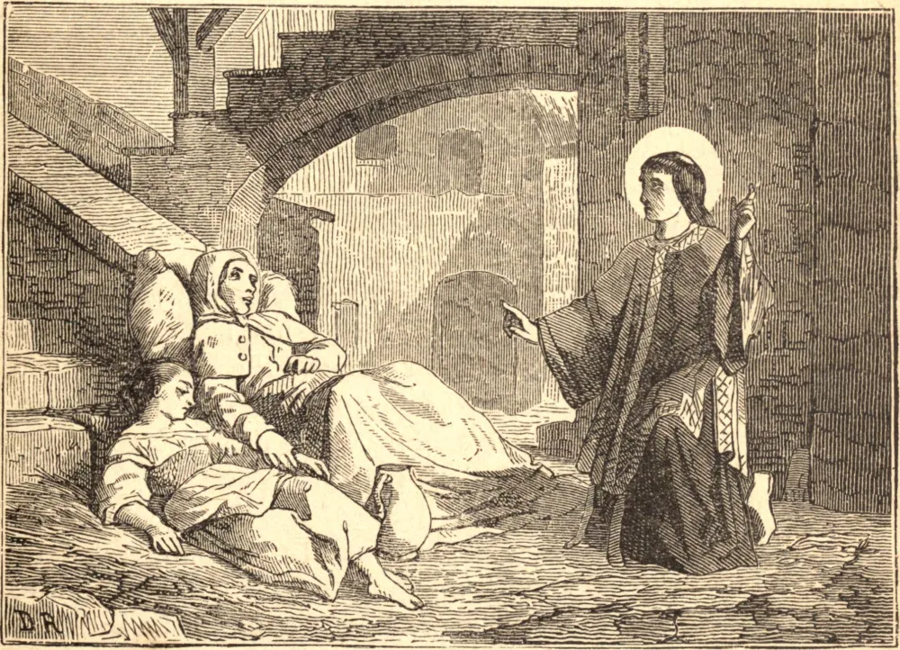

# 22 de maio — SANTO IVO, Confessor

SANTO IVO HELORI, descendente de uma família nobre e virtuosa próxima de Tréguier, na Bretanha, nasceu em 1253. Aos quatorze anos de idade foi para Paris e, depois, para Orleans, a fim de prosseguir seus estudos. Sua mãe costumava dizer-lhe frequentemente que ele devia viver de modo a tornar-se um Santo, ao que sua resposta era sempre que esperava sê-lo. Esta resolução lançou raízes profundas em sua alma, e era um contínuo estímulo à virtude e um freio contra a menor sombra de qualquer caminho perigoso. Seu tempo dividia-se principalmente entre o estudo e a oração; para sua recreação, visitava os hospitais, onde assistia os enfermos com grande caridade e os confortava nas severas provações de sua condição sofredora. Fez um voto particular de castidade perpétua; mas, não sendo isto conhecido, muitos casamentos honrosos lhe foram propostos, os quais recusava modestamente como incompatíveis com sua vida estudiosa.

Por longo tempo deliberou se abraçaria um estado religioso ou clerical; mas o desejo de servir ao próximo o determinou, enfim, em favor do segundo. Desejava, por humildade, permanecer nas ordens menores; mas seu bispo o compeliu a receber o sacerdócio — passo que lhe custou muitas lágrimas, embora se houvesse qualificado para aquela sagrada dignidade pela mais perfeita pureza de mente e de corpo, e por uma longa e fervorosa preparação. Foi nomeado juiz eclesiástico para a diocese de Rennes. Santo Ivo protegia os órfãos e as viúvas, defendia os pobres e administrava a justiça a todos com uma imparcialidade, aplicação e ternura que lhe granjearam a benevolência até daqueles que perdiam suas causas. Foi cognominado o advogado e defensor dos pobres.

Construiu uma casa próxima à sua para um hospital de pobres e enfermos; lavava-lhes os pés, limpava-lhes as úlceras, servia-os à mesa e comia ele próprio apenas as sobras que eles deixavam. Distribuía seu trigo, ou o preço pelo qual o vendia, entre os pobres logo após a colheita. Quando certa pessoa procurou persuadi-lo a guardá-lo por alguns meses, para que pudesse vendê-lo a melhor preço, ele respondeu: "Não sei se estarei vivo então para dá-lo." Outra vez a mesma pessoa lhe disse: "Ganhei um quinto guardando meu trigo." "Mas eu," replicou o Santo, "cem vezes mais dando-o imediatamente."

Durante a Quaresma de 1303, sentiu suas forças desfalecerem; contudo, longe de abrandar coisa alguma em suas austeridades, julgava-se obrigado a redobrar seu fervor à proporção que se aproximava da eternidade. Na véspera da Ascensão, pregou ao seu povo, celebrou a Missa, amparado por duas pessoas, e deu conselho a todos os que a ele se dirigiam. Depois disto, deitou-se em seu leito, que era uma grade de ramos entrelaçados, e recebeu os últimos sacramentos. Daquele momento em diante, entreteve-se somente com Deus, até que sua alma foi possuí-Lo em Sua glória. Sua morte sucedeu no dia 19 de maio de 1303, no quinquagésimo ano de sua idade.

**Reflexão**—Santo Ivo foi um Santo em meio aos perigos do mundo; mas conservou sua virtude incólume somente armando-se cuidadosamente contra eles, conversando assiduamente com Deus na oração e na santa meditação, e fugindo com a maior vigilância dos laços das más companhias. Sem esta precaução, todas as instruções dos pais e todos os outros meios de virtude são ineficazes; e a alma certamente se despedaçará contra este escolho se dele não se desviar bem ao largo.
