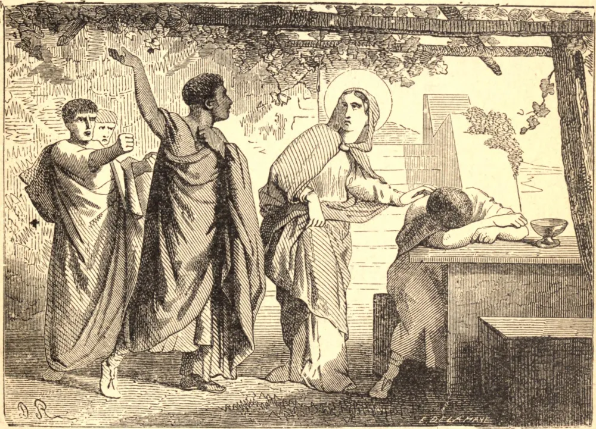

# 23 de maio — SANTA JÚLIA, Virgem, Mártir

JÚLIA era uma nobre virgem de Cartago que, quando a cidade foi tomada por Genserico em 439, foi vendida como escrava a um mercador pagão da Síria chamado Eusébio. Sob os mais humilhantes encargos de sua condição, pela alegria e paciência ela encontrava uma felicidade e um consolo que o mundo não poderia ter proporcionado. Todo o tempo em que não estava ocupada nos afazeres de seu senhor era dedicado à oração e à leitura de livros de piedade.

Seu senhor, que estava encantado com sua fidelidade e demais virtudes, julgou conveniente levá-la consigo numa de suas viagens à Gália. Tendo alcançado a parte setentrional da Córsega, lançou âncora e desceu à terra para juntar-se aos pagãos do lugar numa festividade idolátrica. Júlia foi deixada a alguma distância, porque ela não queria contaminar-se com as cerimônias supersticiosas que abertamente vituperava. Félix, o governador da ilha, que era um pagão fanático, perguntou quem era esta mulher que ousava insultar os deuses. Eusébio informou-lhe que ela era cristã, e que toda a sua autoridade sobre ela era fraca demais para prevalecer e fazê-la renunciar à sua religião, mas que a achava tão diligente e fiel que não podia separar-se dela.

O governador ofereceu-lhe quatro de suas melhores escravas em troca dela. Mas o mercador replicou: "Não; tudo o que possuis não a comprará; pois eu de bom grado perderia a coisa mais valiosa que tenho no mundo antes que ser privado dela."

Contudo, o governador, enquanto Eusébio estava embriagado e adormecido, tomou para si a tarefa de compeli-la a sacrificar aos seus deuses. Ofereceu-se a obter-lhe a liberdade se ela consentisse. A Santa respondeu que era tão livre quanto desejava ser, enquanto lhe fosse permitido servir a Jesus Cristo. Félix, julgando-se escarnecido por seu ar destemido e resoluto, num arrebatamento de fúria mandou que a golpeassem no rosto e lhe arrancassem os cabelos da cabeça, e, por fim, ordenou que fosse pendurada numa cruz até expirar. Certos monges da ilha de Gorgona levaram seu corpo; mas em 763 Desidério, Rei da Lombardia, transferiu suas relíquias para Bréscia, onde sua memória é celebrada com grande devoção.

**Reflexão**—Santa Júlia, fosse livre ou escrava, fosse na prosperidade ou na adversidade, era igualmente fervorosa e devota. Adorava todos os doces desígnios da Providência; e, longe de queixar-se, nunca cessava de louvar e agradecer a Deus sob todas as Suas santas disposições, fazendo delas sempre o meio de sua virtude e santificação. Deus, por uma admirável cadeia de acontecimentos, elevou-a por sua fidelidade à honra dos santos e à dignidade de virgem e mártir.
