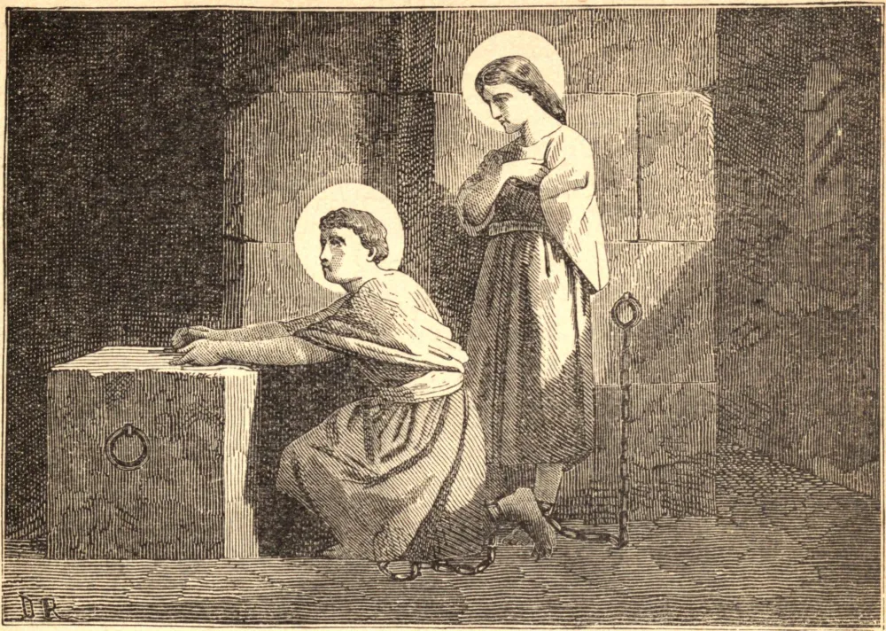

# 24 de maio — SÃO DONACIANO e SÃO ROGACIANO, Mártires

VIVIA em Nantes um ilustre jovem nobre chamado Donaciano que, tendo recebido o santo Sacramento da Regeneração, levava uma vida das mais edificantes, e esforçava-se com muito zelo por converter outros à fé em Cristo. Seu irmão mais velho, Rogaciano, não foi capaz de resistir ao comovente exemplo de sua piedade e à força de seus discursos, e desejou ser batizado. Mas, tendo-se o bispo retirado e ocultado por temor da perseguição, ele não pôde receber aquele sacramento, mas foi pouco depois batizado em seu próprio sangue; pois declarou-se cristão num tempo em que abraçar aquela sagrada profissão era tornar-se candidato ao martírio. Donaciano foi acusado de professar-se cristão e de haver afastado outros, particularmente seu irmão, do culto dos deuses. Donaciano foi, portanto, preso e, tendo confessado ousadamente a Cristo diante do governador, foi lançado no cárcere e carregado de ferros. Rogaciano também foi conduzido perante o prefeito, que procurou primeiro ganhá-lo com discursos lisonjeiros, mas, achando-o inflexível, mandou-o para o cárcere com seu irmão. Rogaciano lamentava não ter podido receber o Sacramento do Batismo, e orava para que o beijo da paz que seu irmão lhe dera o suprisse. Donaciano também orava por ele, para que sua fé lhe alcançasse o efeito do Batismo, e a efusão de seu sangue o do Sacramento da Confirmação. Passaram aquela noite juntos em fervorosa oração. No dia seguinte foram novamente chamados pelo prefeito, ao qual declararam que estavam prontos a sofrer pelo nome de Cristo quaisquer tormentos que lhes fossem preparados. Por ordem do desumano juiz, foram primeiro estirados no potro, depois suas mãos foram traspassadas com lanças, e por fim decepadas, por volta do ano 287.

## Reflexão

Três coisas são agradáveis a Deus e aos homens: a concórdia entre os irmãos, o amor dos pais, e a união do homem e da mulher.
