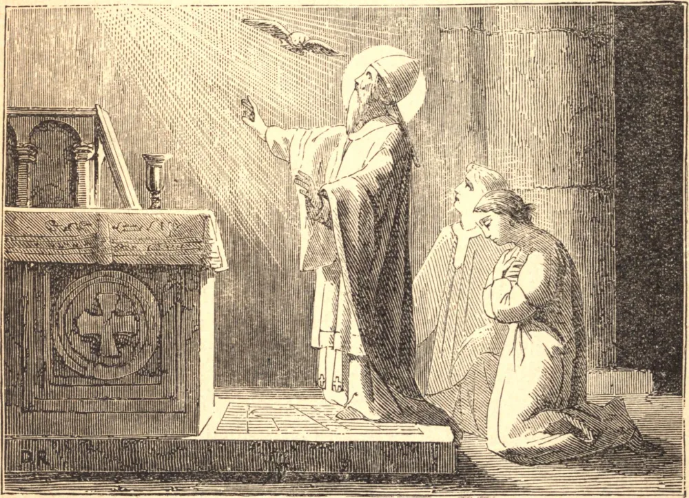

# 25 de maio — SÃO GREGÓRIO VII

GREGÓRIO VII, de nome Hildebrando, nasceu na Toscana, por volta do ano 1013. Foi educado em Roma. Dali foi para a França e tornou-se monge em Cluny. Depois regressou a Roma e, por muitos anos, ocupou altos cargos de confiança da Santa Sé. Três grandes males afligiam então a Igreja: a simonia, o concubinato e o costume de receber a investidura de mãos leigas. Contra estas três corrupções Gregório nunca cessou de contender. Como legado de Vítor II, presidiu a um Concílio em Lião, onde a simonia foi condenada. Foi eleito Papa em 1073 e, de imediato, conclamou os pastores do mundo católico a darem suas vidas antes que traíssem as leis de Deus à vontade dos príncipes.

Roma estava em rebelião por causa da ambição dos Cenci. Gregório excomungou-os. Eles lançaram-lhe as mãos no Natal, durante a Missa da meia-noite, feriram-no e o lançaram no cárcere. No dia seguinte foi resgatado pelo povo.

Surgiu então seu conflito com Henrique IV, Imperador da Alemanha. Este monarca, depois de recair abertamente na simonia, pretendeu depor o Papa. Gregório excomungou o imperador. Seus súditos voltaram-se contra ele e, por fim, buscou ele a absolvição de Gregório em Canossa. Mas não perseverou. Estabeleceu um antipapa e sitiou Gregório no castelo de Santo Ângelo.

O ancião pontífice foi obrigado a fugir e, em 25 de maio de 1085, por volta do septuagésimo segundo ano de sua vida e do décimo segundo ano de seu pontificado, Gregório entrou no seu repouso. Suas últimas palavras estavam cheias de uma divina sabedoria e paciência. Ao morrer, disse: "Amei a justiça e odiei a iniquidade, por isso morro no exílio." Seu fiel assistente respondeu: "Vigário de Cristo, exilado nunca podes ser, pois a ti Deus deu os gentios por herança, e os confins da terra por tua possessão."

**Reflexão**—Oitocentos anos se passaram desde que São Gregório morreu, e vemos o mesmo conflito renovar-se diante de nossos olhos. Aprendamos com ele a sofrer qualquer perseguição do mundo ou do estado, antes que trair os direitos da Santa Sé.
