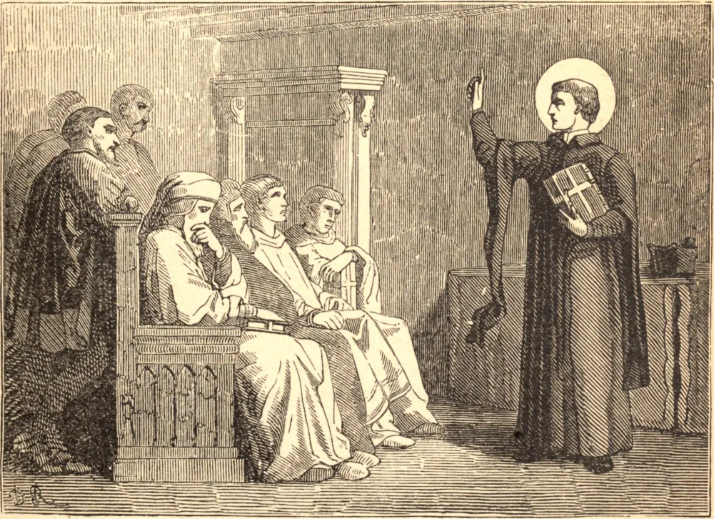

# 26 de maio — SÃO FILIPE NERI

FILIPE foi um da nobre linhagem de Santos suscitados por Deus no século dezesseis para consolar e abençoar Sua Igreja. Após uma infância de angélica beleza, o Espírito Santo o afastou de Florença, lugar de seu nascimento, mostrou-lhe o mundo, para que livremente a ele renunciasse, conduziu-o a Roma, modelou-o na mente, no coração e na vontade, e então, como por um segundo Pentecostes, desceu em forma visível e encheu sua alma de luz, de paz e de alegria. Ele teria ido à Índia, mas Deus o reservou para Roma. Ali prosseguiu simplesmente de dia em dia, atraindo almas a Jesus, exercitando-as na mortificação e na caridade, e ligando-as umas às outras por alegres devoções; assim, sem ele próprio o perceber, sob as mãos de Maria, como dizia, surgiu o Oratório, e toda Roma foi impregnada e transformada por seu espírito. Sua vida foi um contínuo milagre, seu estado habitual um êxtase. Lia os corações dos homens, predizia-lhes o futuro, conhecia-lhes o destino eterno. Seu toque dava saúde ao corpo; seu próprio olhar acalmava as almas atribuladas e afugentava as tentações. Era jovial, afável e irresistivelmente cativante; nem o insulto nem a injúria podiam ofuscar o brilho de sua alegria.

Filipe vivia numa atmosfera de luz e de júbilo que alegrava todos os que dele se aproximavam. "Quando o encontrava na rua," diz um, "ele me dava um tapinha na face e dizia: 'Então, como vai Don Pellegrino?' e me deixava tão cheio de alegria que eu não sabia para que lado estava indo." Outros diziam que, quando ele lhes puxava brincando os cabelos ou as orelhas, seus corações pulavam de alegria. Marcio Altieri sentia tamanho júbilo transbordante em sua presença que dizia ser o quarto de Filipe um paraíso na terra. Fabrizio de Massimi ia, na tristeza ou na perplexidade, e ficava à porta de Filipe; dizia que bastava vê-lo, estar perto dele. E muito tempo depois de sua morte, bastava a muitos, quando atribulados, entrar em seu quarto para encontrar seus corações aliviados e alegrados. Inspirava uma confiança e um amor sem limites, e era o refúgio e o consolador comum de todos. Um gracejo suave veiculava suas repreensões e velava seus milagres. As mais altas honras o procuravam, mas ele as afastava de si. Faleceu em seu octogésimo ano, em 1595, e ostenta o grandioso título de Apóstolo de Roma.

## Reflexão

Filipe desejava que seus filhos servissem a Deus, como os primeiros cristãos, na alegria do coração. Dizia ser este o verdadeiro espírito filial; ele dilata a alma, dando-lhe liberdade e perfeição na ação, poder sobre as tentações, e auxílio mais pleno à perseverança.
