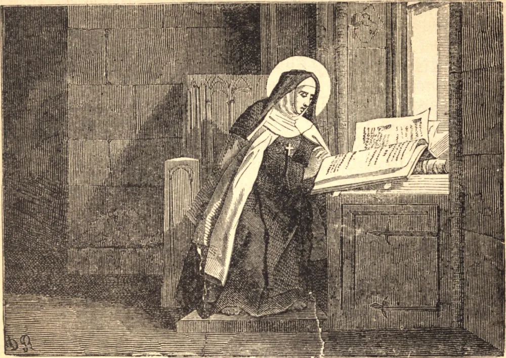

# 27 de maio — SANTA MARIA MADALENA DE PAZZI

SANTA MARIA MADALENA DE PAZZI, de uma ilustre casa de Florença, nasceu no ano de 1566 e foi batizada com o nome de Catarina. Recebeu sua primeira Comunhão aos dez anos de idade e fez voto de virgindade aos doze. Tinha grande prazer em ensinar cuidadosamente a doutrina cristã aos ignorantes. Seu pai, não conhecendo seu voto, desejava dá-la em casamento, mas ela o persuadiu a permitir que se tornasse religiosa. Foi mais difícil obter o consentimento de sua mãe; mas, por fim, ela o alcançou, e fez profissão, contando então dezoito anos de idade, no mosteiro carmelita de Santa Maria degli Angeli, em Florença, a 17 de maio de 1584. Mudou seu nome de Catarina para o de Maria Madalena ao tornar-se freira, e tomou por lema: "Sofrer ou morrer"; e sua vida dali em diante foi uma vida de penitência por pecados que não eram os seus, e de amor a Nosso Senhor, que a provou por caminhos temíveis e estranhos. Era obediente, observante da regra, humilde e mortificada, e tinha grande reverência pela vida religiosa. Amava a pobreza e o sofrimento, e tinha fome da Comunhão. O dia da Comunhão chamava o dia do amor. A caridade que ardia em seu coração levou-a, em sua juventude, a escolher a casa das carmelitas, porque as religiosas ali comungavam todos os dias. Regozijava-se em ver as outras comungar, mesmo quando a ela própria não era permitido fazê-lo; e seu amor por suas irmãs crescia ao vê-las receber Nosso Senhor.

Deus a elevou a altos estados de oração e lhe deu raros dons, capacitando-a a ler os pensamentos de suas noviças, e enchendo-a de sabedoria para dirigi-las retamente. Foi por duas vezes escolhida mestra de noviças, e depois feita superiora, quando Deus a tomou para Si, a 25 de maio de 1607. Seu corpo está incorrupto.

## Reflexão

Santa Maria Madalena de Pazzi estava de tal modo cheia do amor de Deus que suas irmãs no mosteiro o observavam em seu amor por elas, e a chamavam "a Mãe da Caridade" e "a Caridade do Mosteiro."
