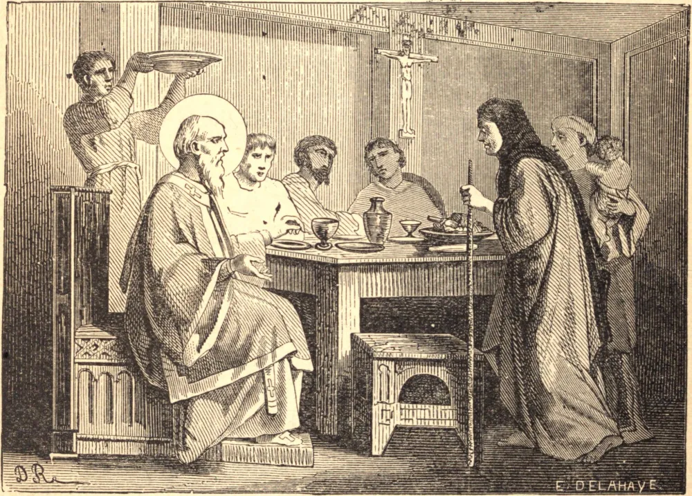

# 28 de maio — SÃO GERMANO, Bispo

SÃO GERMANO, glória da Igreja da França no século sexto, nasceu no território de Autun, por volta do ano 469. Em sua juventude foi notável por seu fervor. Sendo ordenado sacerdote, foi feito abade de São Sinforiano; foi favorecido naquele tempo com os dons dos milagres e da profecia. Era seu costume velar grande parte da noite na igreja em oração, enquanto seus monges dormiam. Certa noite, em sonho, julgou que um venerável ancião lhe apresentava as chaves da cidade de Paris, e lhe dizia que Deus confiava aos seus cuidados os habitantes daquela cidade, para que ele os salvasse de perecer.

Quatro anos após esta admoestação divina, em 554, achando-se em Paris quando aquela sé ficou vaga pelo falecimento do Bispo Eusébio, foi elevado à cadeira episcopal, embora se esforçasse por muitas lágrimas em declinar do encargo. Sua promoção não fez alteração em seu modo de vida. A mesma simplicidade e frugalidade apareciam em suas vestes, mesa e mobília. Sua casa estava perpetuamente repleta de pobres e aflitos, e tinha sempre muitos mendigos à sua própria mesa. Deus deu aos seus sermões uma maravilhosa influência sobre as mentes de todas as classes de pessoas; de modo que a face de toda a cidade em muito breve tempo ficou inteiramente mudada. O Rei Childeberto, que até então fora um príncipe ambicioso e mundano, foi inteiramente convertido pela doçura e pelos poderosos discursos do Santo, e fundou muitas instituições religiosas, e enviou grandes somas de dinheiro ao bom bispo, para serem distribuídas entre os indigentes.

Em sua velhice, São Germano nada perdeu daquele zelo e atividade com que cumprira os grandes deveres de seu estado no vigor de sua vida; nem a debilidade a que suas austeridades corporais o haviam reduzido o fez abrandar coisa alguma nas mortificações de sua vida penitente, na qual redobrava seu fervor à medida que se aproximava do fim de seu curso. Por seu zelo, os restos da idolatria foram extirpados na França. O Santo continuou seus labores pela conversão dos pecadores até ser chamado a receber a recompensa deles, no dia 28 de maio de 576, contando oitenta anos.

**Reflexão**—"Nas assembleias bendizei a Deus, o Senhor. Do Teu templo os reis Te oferecerão presentes."
