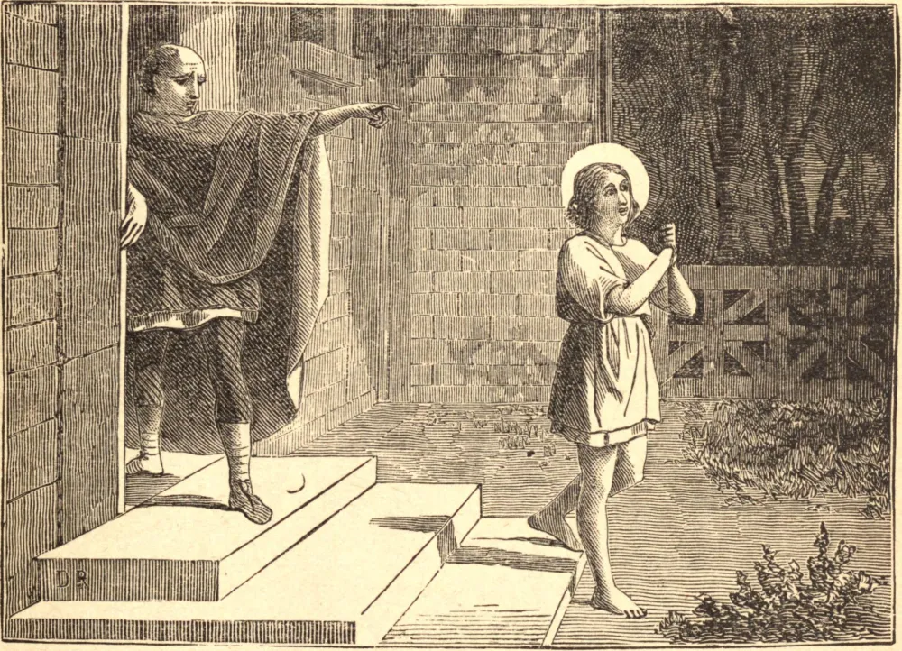

# 29 de maio — SÃO CIRILO, Mártir

SÃO CIRILO padeceu ainda menino em Cesareia da Capadócia, durante as perseguições do terceiro século. Costumava repetir o nome de Cristo a toda hora, e confessava que a mera pronúncia deste nome o comovia estranhamente. Foi espancado e injuriado por seu pai pagão. Mas suportou tudo isto com alegria, crescendo na força de Cristo, que habitava dentro dele, e atraindo muitos de sua idade à imitação de sua vida celeste. Quando seu pai, em sua fúria, o expulsou de casa, ele disse que perdera pouco, e que receberia em troca uma grande recompensa.

Pouco depois, foi levado perante o magistrado por causa de sua fé. Nenhuma ameaça pôde fazê-lo mostrar sinal de temor, e o juiz, compadecendo-se talvez de seus tenros anos, ofereceu-lhe a liberdade, assegurou-lhe o perdão de seu pai, e suplicou-lhe que voltasse ao seu lar e à sua herança. Mas o bem-aventurado jovem replicou: "Deixei meu lar com alegria, pois tenho um maior e melhor que me aguarda." Esteve cheio dos mesmos desejos celestes até o fim. Foi levado às fogueiras como que para a execução, e foi então trazido de volta e reexaminado, mas ele apenas protestou contra a cruel demora. Conduzido para morrer, apressou os executores, contemplou impassível as chamas que se acendiam para ele, e expirou, apressando-se, como dizia, para o seu lar.

**Reflexão**—Pedi a Nosso Senhor que torne insípida toda alegria terrena, e que vos encha do constante desejo do céu. Este desejo tornará fácil o labor e leve o sofrimento. Ele vos tornará fervorosos e desprendidos, e vos trará, ainda aqui, uma antegustação daquela alegria e paz eternas para as quais vos apressais.
