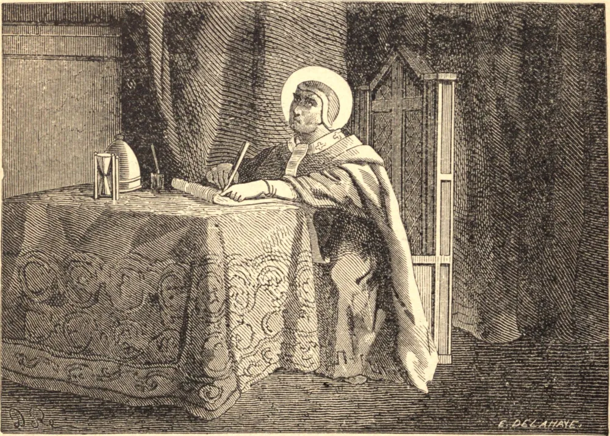

# 30 de maio — SÃO FÉLIX I, Papa e Mártir

SÃO FÉLIX era romano de nascimento e sucedeu a São Dionísio no governo da Igreja em 269. Paulo de Samósata, o soberbo Bispo de Antioquia, à culpa de muitos crimes enormes acrescentou a da heresia, ensinando que Cristo não era mais do que um simples homem, no qual o Verbo Divino habitava por sua operação e como em seu templo, com muitos outros erros grosseiros acerca dos mistérios capitais da Trindade e da Encarnação. Três concílios foram realizados em Antioquia para examinar a sua causa, e no terceiro, reunido em 269, sendo claramente convencido de heresia, soberba e muitos crimes escandalosos, foi excomungado e deposto, e Domno foi posto em seu lugar. Como Paulo ainda mantinha a posse da casa episcopal, o nosso Santo recorreu ao Imperador Aureliano, que, embora pagão, deu ordem para que a casa pertencesse àquele a quem os bispos de Roma e da Itália a adjudicassem. Irrompendo a perseguição de Aureliano, São Félix, destemido do perigo, fortaleceu os fracos, encorajou a todos, batizou os catecúmenos e continuou a esforçar-se em converter os infiéis à Fé. Ele próprio obteve a glória do martírio. Governou a Igreja cinco anos e passou a uma gloriosa eternidade em 274.

## Reflexão

O exemplo de Nosso Salvador e de todos os Seus santos deve encorajar-nos, em todas as provações, a sofrer com paciência e até com alegria. Em breve começaremos a sentir que é doce caminhar nos passos de um Deus-homem, e haveremos de descobrir que, se corajosamente tomarmos as nossas cruzes, Ele as tornará leves ao partilhar conosco o fardo.
