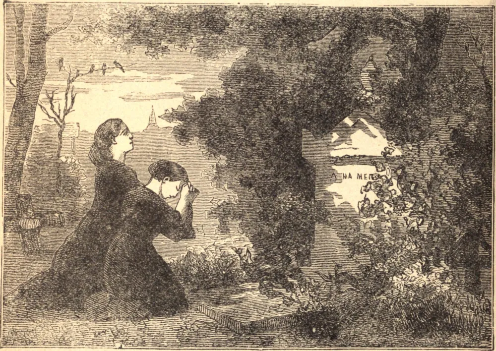

# 2 de novembro — TODOS OS FIÉIS DEFUNTOS

A Igreja nos ensina que as almas dos justos que deixaram este mundo manchadas pela mácula do pecado venial permanecem por um tempo num lugar de expiação, onde sofrem o castigo que possa ser devido às suas ofensas. É matéria de fé que estas almas sofredoras são aliviadas pela intercessão dos Santos no céu e pelas orações dos fiéis sobre a terra. Orar pelos mortos é, pois, ao mesmo tempo um ato de caridade e de piedade. Lemos na Sagrada Escritura: "É um pensamento santo e salutar orar pelos mortos, para que sejam libertados de seus pecados." E quando Nosso Senhor inspirou São Odilão, Abade de Cluny, por volta do fim do século décimo, a estabelecer em sua Ordem uma comemoração geral de todos os fiéis defuntos, foi logo adotada por toda a Igreja Ocidental, e tem sido continuada incessantemente até os nossos dias. Tenhamos, pois, sempre em mente os mortos e ofereçamos nossas orações por eles. Mostrando esta misericórdia às almas sofredoras no purgatório, teremos particular direito a ser tratados com misericórdia em nossa partida deste mundo, e a participar mais abundantemente dos sufrágios gerais da Igreja, continuamente oferecidos por todos os que adormeceram em Cristo.
