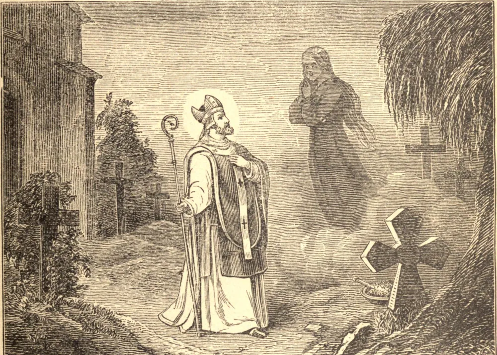

# SÃO MALAQUIAS, Bispo

DURANTE sua infância, Malaquias muitas vezes se separava de seus companheiros para conversar em oração com Deus. Aos vinte e cinco anos foi ordenado sacerdote; sua devoção e zelo levaram-no a ser sagrado Bispo de Connor, e pouco depois foi feito Arcebispo de sua cidade natal, Armagh. Tendo esta sé, por um abuso de longa data, sido mantida como herança numa só família, foi necessário da parte do Santo não pouco tato e firmeza para aplacar as dissensões causadas por sua eleição. Certo dia, enquanto São Malaquias sepultava os mortos, foi escarnecido por sua irmã. Quando ela morreu, ele celebrou muitas Missas por ela. Algum tempo depois, numa visão, ele a viu, vestida de luto, de pé num adro de igreja, dizendo que não provara alimento havia trinta dias. Lembrando-se de que fazia justamente trinta dias desde que oferecera pela última vez o Adorável Sacrifício por ela, começou de novo a fazê-lo, e foi recompensado com outras visões, na última das quais a viu dentro da igreja, vestida de branco, junto ao altar, e rodeada de espíritos resplandecentes. Fez duas vezes uma peregrinação a Roma, para consultar o Vigário de Cristo, voltando da primeira vez como Legado Papal, em meio à alegria de seu povo, com o pálio para Armagh; mas da segunda vez encaminhado para um lar mais feliz. Adoeceu em Claraval. Morreu, aos cinquenta e quatro anos, ali onde de bom grado teria vivido, no mosteiro de São Bernardo, no dia 2 de novembro de 1148.

## Reflexão

Nosso Senhor disse a Santa Gertrudes: "Deus aceita cada alma que libertas, como se a tivesses resgatado do cativeiro, e te recompensará no tempo devido pelo benefício que conferiste."
