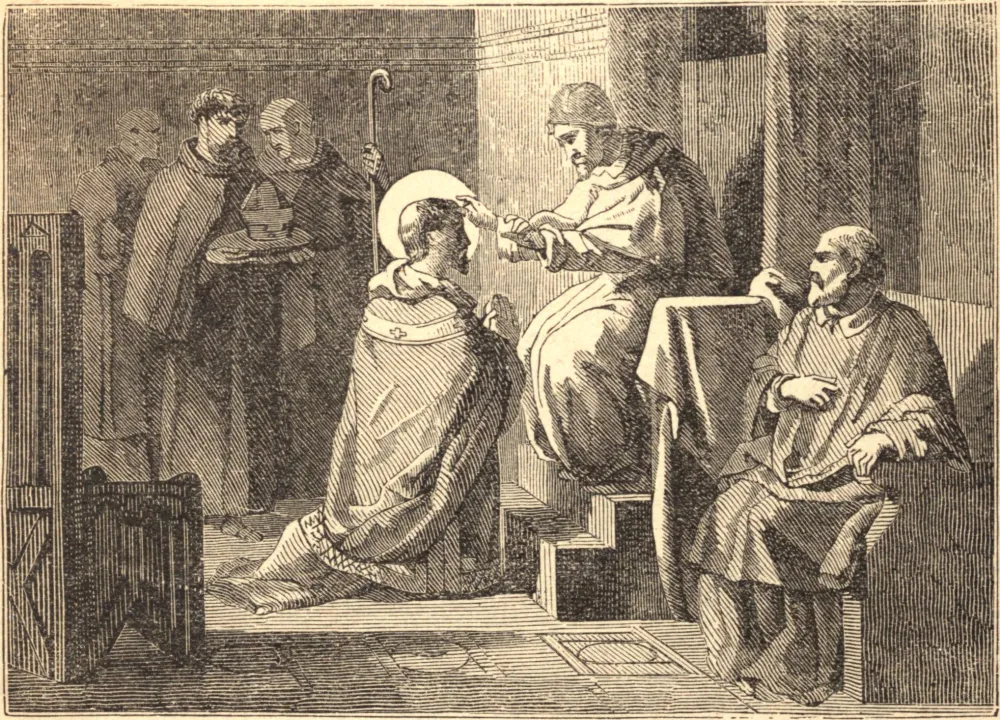

# 7 de novembro — SÃO VILIBRORDO

VILIBRORDO nasceu na Nortúmbria em 657, e aos vinte anos de idade foi à Irlanda, para estudar sob São Egberto; doze anos depois, sentiu-se atraído a converter as grandes tribos pagãs que pairavam como uma nuvem sobre o norte da Europa. Foi a Roma pela bênção do Papa, e com onze companheiros chegou a Utrecht. Os pagãos não aceitavam a religião de seus inimigos, os francos; e São Vilibrordo só pôde trabalhar no rastro de Pepino de Heristal, convertendo as tribos que Pepino subjugava. A urgente pedido de Pepino, foi novamente a Roma, e foi consagrado Arcebispo de Utrecht.

Era majestoso e de bela aparência, franco e alegre, sábio no conselho, agradável na palavra, em toda obra de Deus esforçado e incansável. Multidões foram convertidas, e o Santo edificou igrejas e nomeou sacerdotes por toda a terra. Operou muitos milagres, e teve o dom da profecia. Trabalhou incessantemente como bispo por mais de cinquenta anos, amado igualmente de Deus e dos homens, e faleceu cheio de dias e de boas obras.

**Reflexão**—O verdadeiro zelo tem sua raiz no amor de Deus. Nunca pode ficar ocioso; deve trabalhar, labutar, realizar grandes coisas. Arde como o fogo; é, como o fogo, insaciável. Vê se este espírito está em ti!
